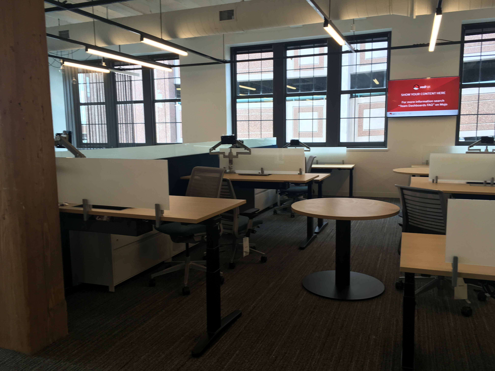
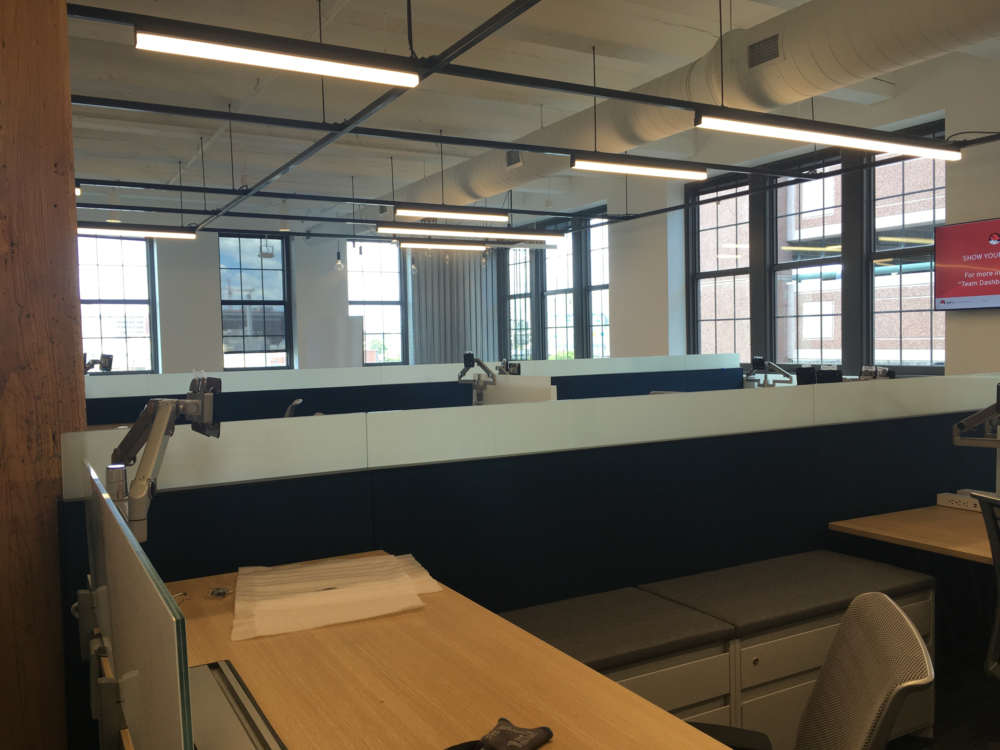
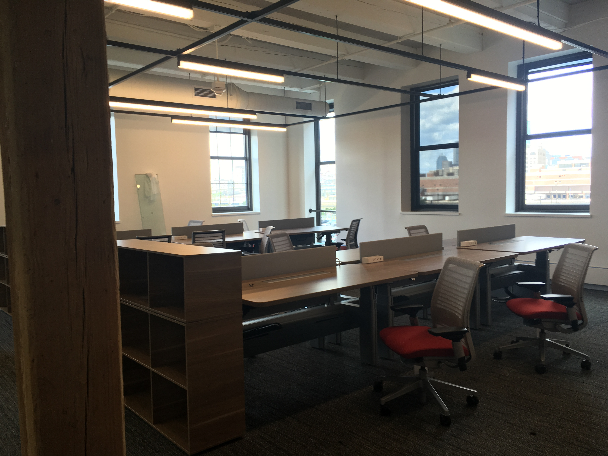
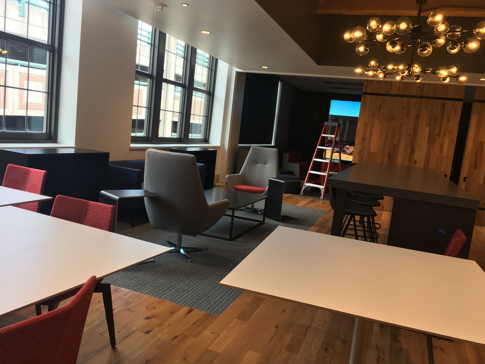
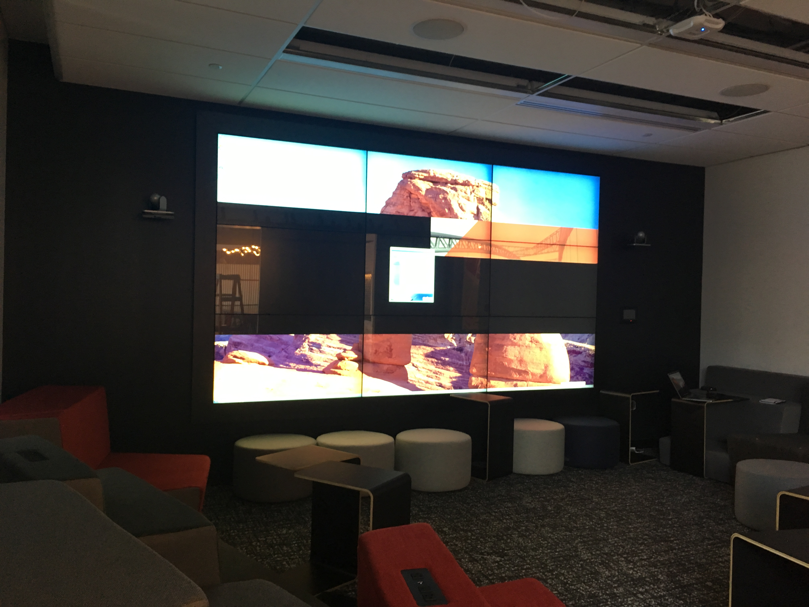

For this summer until the end of Aug., there is a good possibility that we could use a space in the Red Hat building 
at the Seaport. 

Address of the building : 300 Necco St. Boston 

Duration : June - end of August

Pros : 
1. Brand new large and plenty of space for at least 30 people. See the specific space in the photos below. 
1. Shower and change room(s) 
1. You get to tell your friends you work at Red Hat (literally "at" Red Hat)  

Cons : 
1. Further away from BU/NEU/Harvard U./MIT where all of our contacts/collaborators are.  
1. Less convenient commute for Allston/Brighton/Brookline/Newton folks, but perhaps better for Cambridge etc. people  
1. Parking? As the "joke" goes, 20 years ago the Seaport was entirely parking lots, now not so much  
1. Food nearby is more expensive

### Work Space Photos 
[Click here](https://goo.gl/photos/wxTsXkydQkPYuj958) to see additional photos from Sahil

