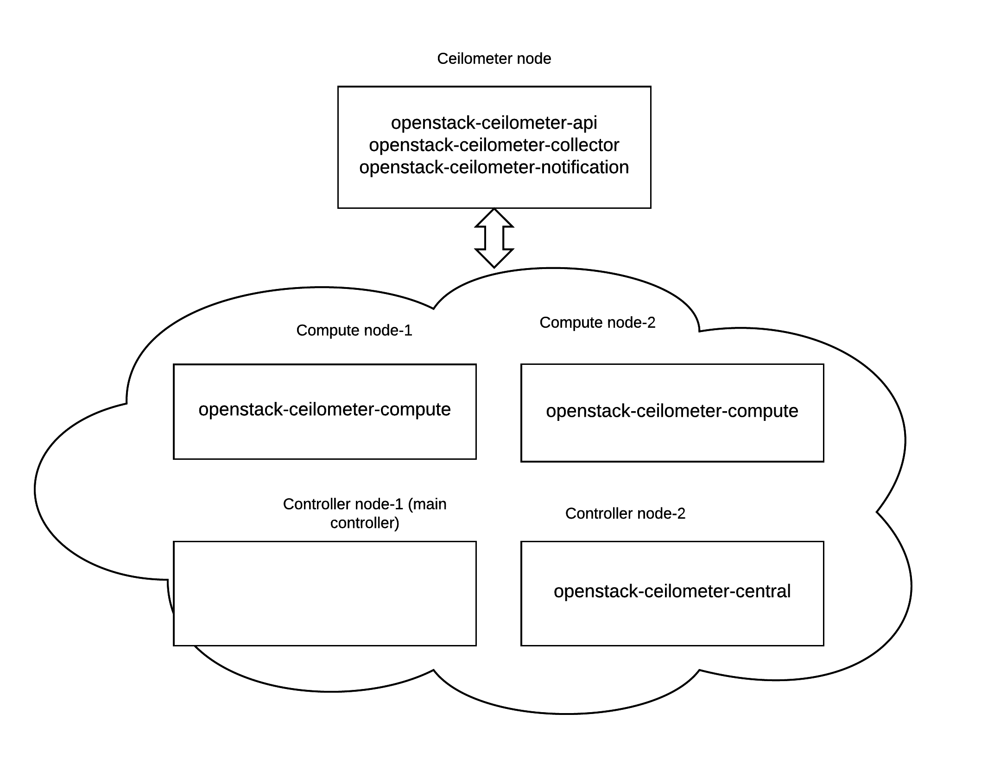
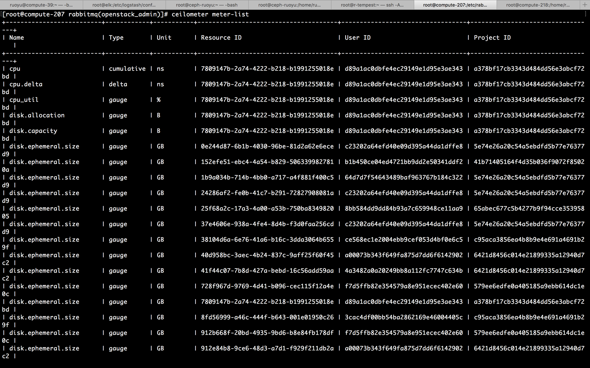

# Ceilometer Deployment Guide
This guide will show you how to deploy ceilometer in a staging environment that is similar to our production environment in a sense that it also has two controller nodes. 

In detail, this staging environment contains two openstack controller nodes, two openstack compute nodes and one ceilometer node. One of the controller node is the major controller node and the other one is the minor controller node that could switch to work when the major controller node is down. 

The nodes in this environment are all running Centos 7. 

This guide will not cover installing ceilometer alarming service as it is not belongs to the core services of ceilometer.

### System Overview
We will deploy different part of ceilometer services to the openstack system as shown in the below diagram.



On the ceilometer node, below services are installed:
* **openstack-ceilometer-api**: service to query and view data recorded by collector in internal full-fidelity database(MongoDB).
* **openstack-ceilometer-collector
**: daemon designed to gather and record event and metering data created by notification and polling agents.
* **openstack-ceilometer-notification**: daemon designed to listen to notifications on message queue, convert them to Events and Samples, and apply pipeline actions.

On the openstack compute nodes, below service is installed:
* **openstack-ceilometer-compute**: also is polling agent, daemon designed to poll OpenStack services and build Meters.

On the minor openstack controller node, below service is installed:
* **openstack-ceilometer-central**: Polling via service APIs for non-compute resources.

### Install the Telemetry Service
1. **Configure the ceilometer node**
 * With the vi editor, create a `.repo` file for yum, the package management utility for CentOS
```
sudo vi /etc/yum.repos.d/mongodb-org.repo
```
 * **Add the repository information** for the latest stable release to the file
```
[mongodb-org-3.2]
name=MongoDB Repository
baseurl=https://repo.mongodb.org/yum/redhat/$releasever/mongodb-org/3.2/x86_64/
gpgcheck=1
enabled=1
gpgkey=https://www.mongodb.org/static/pgp/server-3.2.asc`
```
 * Save and close the file.
 * Next **install MongoDB package**:
```
sudo yum install mongodb-org
sudo systemctl start mongod
sudo systemctl enable mongod
```
 * **Install ceilometer packages**
```	
yum install -y openstack-ceilometer-api openstack-ceilometer-collector openstack-ceilometer-notification python-ceilometer python-ceilometerclient
```
 * **Start the MongoDB service**:
```
systemctl start mongod.service
```
 * Open the `/etc/sysconfig/iptables` file in a text editor and **add an INPUT rule allowing TCP traffic on port 27017**. The new rule must appear before any INPUT rules that REJECT traffic:
```
-A INPUT -p tcp -m multiport --dports 27017 -j ACCEPT
```
 * **Restart the iptables service** to ensure that the change takes effect
```
systemctl restart iptables.service
```
 * **Create a database in MongoDB** for the Telemetry service:
```
mongo --host MONGOHOST --eval '
   db = db.getSiblingDB("ceilometer");
   db.addUser({user: "ceilometer",
	   pwd: "MONGOPASS",
	   roles: [ "readWrite", "dbAdmin" ]})'
```
  This also creates a database user named ceilometer. 
  
  Replace **MONGOHOST** with the IP address or host name of the server hosting the MongoDB database. Replace **MONGOPASS** with a password for the ceilometer user.
 * **Set the database connection string**:
```
openstack-config --set /etc/ceilometer/ceilometer.conf \
database connection mongodb://localhost:27017/ceilometer
```
2. **Create Telemetry Identity Records**
 * On controller node **set up the shell to access keystone as the administrative user**:
```
source /root/keystonerc_admin
```
 * **Create the ceilometer user**:
```
keystone user-create --name ceilometer --tenant PROJECTID --pass PASSWORD --email CEILOMETER_EMAIL --enabled TRUE
```
  * Replace **PROJECTID** with the project ID, you could find by the command "OpenStack project list".
  * Replace **PASSWORD** with the password that will be used by the Telemetry service when authenticating with the Identity service.
  * Replace **CEILOMETER_EMAIL** with the email address used by the Telemetry service.

 * **Create the ResellerAdmin role**:
```
keystone role-create --name ResellerAdmin
```
 * **Link the ceilometer user and the ResellerAdmin role** together within the context of the services tenant
```
keystone user-role-add --user ceilometer --role ResellerAdmin --tenant services
```
 * **Link the ceilometer user and the admin role** together within the context of the services tenant
```
keystone user-role-add --user ceilometer --role admin --tenant services
```
 * **Create the ceilometer service**
```
keystone service-create --name ceilometer --type metering --description "OpenStack Telemetry Service"
```
 * **Create the ceilometer endpoint**

	keystone endpoint-create --region <endpoint-region> --service ceilometer --publicurl 'IP:8777' --adminurl 'IP:8777' --internalurl 'IP:8777'

  * Replace **IP** with the IP address or host name of the server hosting the Telemetry service.
  * Replace **region** with the actual region name.
  * You could get the region name and other information for reference from other endpoints like nova. Just do `openstack endpoint show nova`.

### Configure Telemetry Service Authentication

Log in to your ceilometer node and perform the following steps to configure ceilometer. These steps use command line to modify the `ceilometer.conf` file but you could also modify the file using a text editor like vim.

**Set the Identity service host** that the Telemetry API service must use:

```
# openstack-config --set /etc/ceilometer/ceilometer.conf \
   keystone_authtoken auth_host IP
```
Replace **IP** with the IP address or host name of the server hosting the Identity service.

**Set the authentication port** that the Telemetry API service must use:
```
# openstack-config --set /etc/ceilometer/ceilometer.conf \
   keystone_authtoken auth_port PORT
```
Replace **PORT** with the authentication port used by the Identity service, usually 35357.

**Set the Telemetry API service to use the http protocol** for authenticating:
```
# openstack-config --set /etc/ceilometer/ceilometer.conf \
   keystone_authtoken auth_protocol http
```

Set the Telemetry API service to **authenticate as the correct tenant**.
```
# openstack-config --set /etc/ceilometer/ceilometer.conf \
   keystone_authtoken admin_tenant_name services
```
Replace **services** with the name of the tenant created for the use of the Telemetry service. Examples in this guide use services.

Set the Telemetry service to **authenticate using the ceilometer administrative user account**:
```
# openstack-config --set /etc/ceilometer/ceilometer.conf \
   keystone_authtoken admin_user ceilometer
```

Set the Telemetry service to use the **correct ceilometer administrative user account password**:
```
# openstack-config --set /etc/ceilometer/ceilometer.conf \
   keystone_authtoken admin_password PASSWORD
```
Replace **PASSWORD** with the password set when the ceilometer user was created.

The Telemetry secret is a string used to help secure communication between all components of the Telemetry service across multiple hosts (for example, between the Collector agent and a Compute node agent). **Set the Telemetry secret**:
```
# openstack-config --set /etc/ceilometer/ceilometer.conf \
   publisher_rpc metering_secret SECRET
```
Replace **SECRET** with the string that all Telemetry service components should use to sign and verify messages that are sent or received over AMQP.

**Configure the service endpoints to be used by the Central agent, Compute agents, and Evaluator** on the host where each component is deployed:
```
# openstack-config --set /etc/ceilometer/ceilometer.conf \
   DEFAULT os_auth_url http://IP:35357/v2.0
# openstack-config --set /etc/ceilometer/ceilometer.conf \
   DEFAULT os_username ceilometer
# openstack-config --set /etc/ceilometer/ceilometer.conf \
   DEFAULT os_tenant_name services   
# openstack-config --set /etc/ceilometer/ceilometer.conf \
   DEFAULT os_password PASSWORD
```
Replace the following values:
* **IP** with the IP address or host name of the server hosting the Identity service.
* **PASSWORD** with the password set when the ceilometer user was created.

You could find these information in the OpenStack RC file.

### Configure the Firewall to Allow Telemetry Service Traffic

Open the `/etc/sysconfig/iptables` file in a text editor.

**Add an INPUT rule allowing TCP traffic on port 8777**. The new rule must appear before any INPUT rules that REJECT traffic:
```
-A INPUT -p tcp -m multiport --dports 8777 -j ACCEPT
```
Save the changes to the `/etc/sysconfig/iptables` file.

**Restart the iptables service** to ensure that the change takes effect.
```
# systemctl restart iptables.service
```

### Configure RabbitMQ Messsage Broker Settings
RabbitMQ is the default (and recommended) message broker. You could find your rabbitmq account information in the `/etc/rabbitmq/rabbitmq.config` file.

* Set **RabbitMQ as the RPC back end**:
```
# openstack-config --set /etc/ceilometer/ceilometer.conf \
   DEFAULT rpc_backend rabbit
```

* Set the Telemetry service to **connect to the RabbitMQ** host:
```
# openstack-config --set /etc/ceilometer/ceilometer.conf \
   DEFAULT rabbit_host RABBITMQ_HOST
```
Replace RABBITMQ_HOST with the IP address or host name of the message broker.

* Set the **message broker port to 5672**:
```
# openstack-config --set /etc/ceilometer/ceilometer.conf \
   DEFAULT rabbit_port 5672
```

* **Set the RabbitMQ user name and password** created for the Telemetry service when RabbitMQ was configured:
```
# openstack-config --set /etc/ceilometer/ceilometer.conf \
   DEFAULT rabbit_userid <rabbit_user>
# openstack-config --set /etc/ceilometer/ceilometer.conf \
   DEFAULT rabbit_password <rabbit_pass>
```
Replace <rabbit_user> and <rabbit_pass> with the RabbitMQ user name and password. 

When RabbitMQ was launched, the ceilometer user was granted read and write permissions to all resources: specifically, through the virtual host /. 

Configure the Telemetry service to connect to this virtual host.
```
# openstack-config --set /etc/ceilometer/ceilometer.conf \
   DEFAULT rabbit_virtual_host /
```

### Configure the Compute Node

Login to each openstack compute node as openstack admin. Do the following procedure:

* **Install python-ceilometer and python-ceilometerclient** on the node: (below is updated from the online tutorial)
```
# yum -y install openstack-ceilometer-compute python-ceilometer python-ceilometerclient
```

* **Enable auditing** on the node:
```
# openstack-config --set /etc/nova/nova.conf \
   DEFAULT instance_usage_audit True
Configure the audit frequency:
# openstack-config --set /etc/nova/nova.conf \
   DEFAULT instance_usage_audit_period hour
Configure what type of state changes should trigger a notification:
# openstack-config --set /etc/nova/nova.conf \
   DEFAULT notify_on_state_change vm_and_task_state
```

* **Set the node to use the correct notification drivers**. Open the `/etc/nova/nova.conf` file in a text editor, and add the following lines in the DEFAULT section:
```
notification_driver = messagingv2
notification_driver = ceilometer.compute.nova_notifier
```

The Compute node requires two different notification drivers, which are defined using the same configuration key. You cannot use openstack-config to set these values.

* **Start the Compute agent**:
```
# systemctl start openstack-ceilometer-compute.service
Configure the agent to start at boot time:
# systemctl enable openstack-ceilometer-compute.service
Restart the openstack-nova-compute service to apply all changes to /etc/nova/nova.conf:
# systemctl restart openstack-nova-compute.service
```

### Configure Monitored Services

Login to the openstack main controller node as admin and perform the following processes:

**Image service** (glance)
```
# openstack-config --set /etc/glance/glance-api.conf \
   DEFAULT notifier_strategy NOTIFYMETHOD
```
Replace **NOTIFYMETHOD** with a notification queue: rabbit (to use a rabbitmq queue) or qpid (to use a qpid message queue).

**Block Storage service** (cinder)
```
# openstack-config --set /etc/cinder/cinder.conf \	
   DEFAULT notification_driver messagingv2
# openstack-config --set /etc/cinder/cinder.conf \	
   DEFAULT rpc_backend cinder.openstack.common.rpc.impl_kombu
# openstack-config --set /etc/cinder/cinder.conf \	
   DEFAULT control_exchange cinder
```

**Object Storage service** (swift)

The Telemetry service collects samples from the Object Storage service (swift) through the ResellerAdmin role that was created when configuring the required Identity records for Telemetry. 

You must also configure the Object Storage service to process traffic from ceilometer.

Open the `/etc/swift/proxy-server.conf` file in a text editor, and **add or update the following lines**:
```
[filter:ceilometer]
use = egg:ceilometer#swift

[pipeline:main]
pipeline = healthcheck cache authtoken keystoneauth ceilometer proxy-server
```

**Add the swift user to the ceilometer group**:
```
# usermod -a -G ceilometer swift
Allow the Object Storage service to output logs to /var/log/ceilometer/swift-proxy-server.log:
# touch /var/log/ceilometer/swift-proxy-server.log
# chown ceilometer:ceilometer /var/log/ceilometer/swift-proxy-server.log
# chmod 664 /var/log/ceilometer/swift-proxy-server.log
```

**OpenStack Networking** (neutron)

Telemetry supports the use of labels for distinguishing IP ranges. Enable OpenStack Networking integration with Telemetry:
```
# openstack-config --set /etc/neutron/neutron.conf \	
   DEFAULT notification_driver messagingv2
```

### Set up Ceilometer Central-agent
Ceilometer central agent service is responsible for polling via service APIs for non-compute resources. It should run on a cloud controller node.

Login to the minor OpenStack controller node as openstack admin and perform the following steps:

```
yum install python-ceilometer python-ceilometerclient openstack-ceilometer-central
```

Please configure the `ceilometer.conf` file the same with on other nodes.

### Launch the Ceilometer API and Agents
On every node, launch the corresponding service for each component of the Telemetry service, and configure each service to start at boot time:

```
# systemctl start SERVICENAME.service
# systemctl enable SERVICENAME.service
```

Replace **SERVICENAME** with the corresponding name of each Telemetry component service:
- openstack-ceilometer-compute
- openstack-ceilometer-central
- openstack-ceilometer-collector
- openstack-ceilometer-api
- openstack-ceilometer-alarm-evaluator
- openstack-ceilometer-alarm-notifier
- openstack-ceilometer-notification

### Finish
If you have done every part right. Then you should have ceilometer up and running in your system. You could verify this by logging in to one of your OpenStack node as OpenStack admin.

Type `ceilometer meter-list`. This command will show all the meters currently enabled. You should get the results like below:



You could learn more ceilometer commands by typing `ceilometer --help`

Congratulations!

