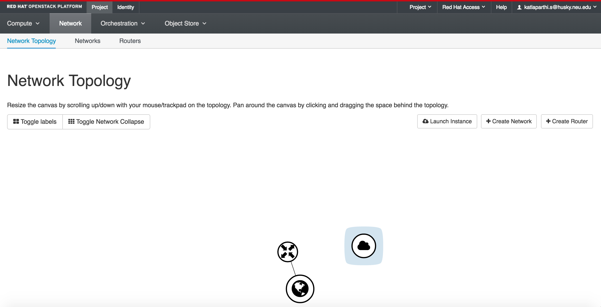
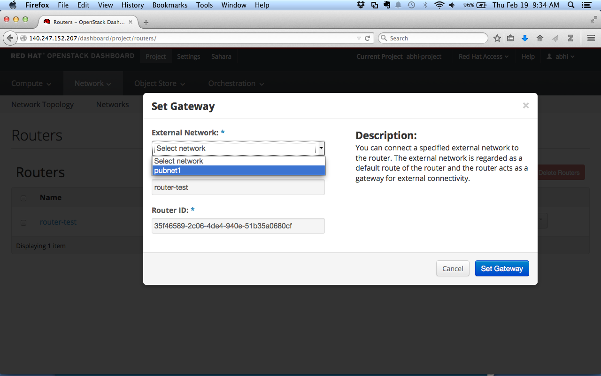
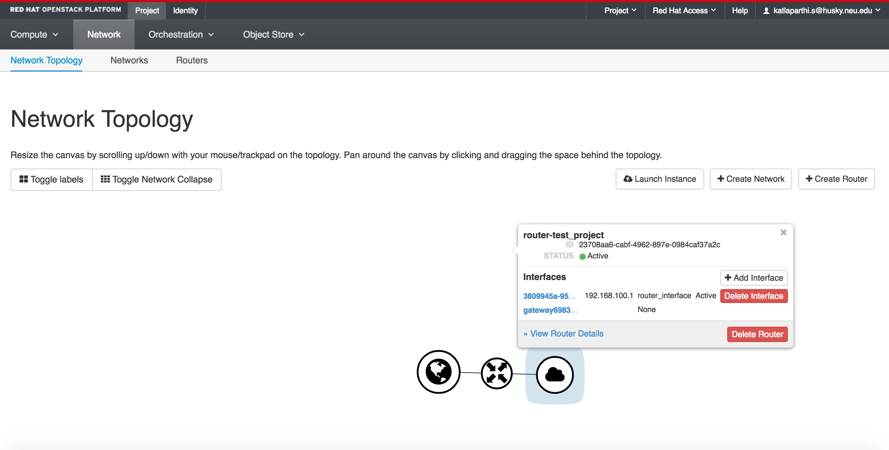
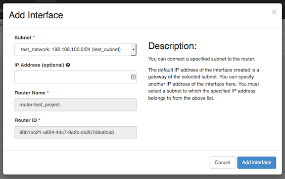
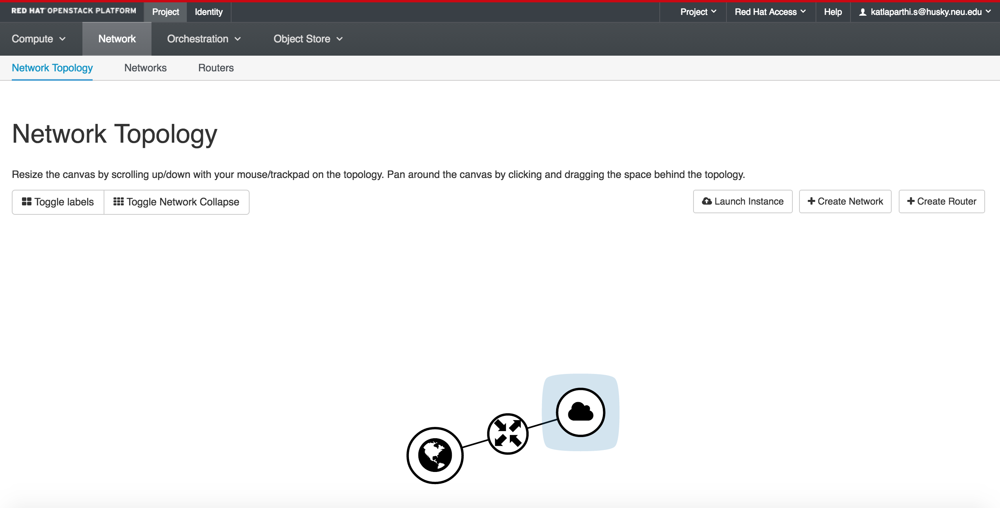
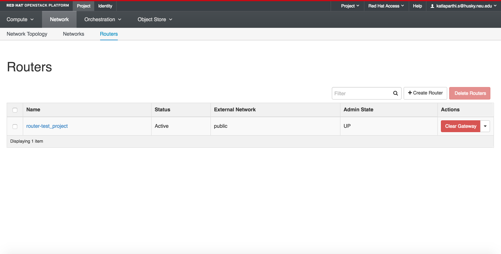

# Create Router
A router acts as a gateway for external connectivity.

By connecting your private network to the public network via a router, you can connect your instance to the Internet, install packages, etc. without needing to associate it with a public IP address.

From the Network Topology page click on Create Router.  

Give your router a name that indicates what project it is attached to.

From the External Network dropdown, select the 'public' network, and click Create.

You should now see the router in the Network Topology view. (It also appears under Project -> Network -> Routers).

Notice that it is now connected to the public network, but not your private network.

### Set Router Gateway
Navigate to Project -> Network -> Routers.

Need to setup a gateway to attach router to the Public Network.      

For the new router you just created, click on "Set Gateway" under Actions box.  

Choose the external network "Public".  
  

Click on Set Gateway.

### Set Internal Interface on the Router
In order to route between your private network and the outside world, you must give the router an interface on your private network.

From the Network Topology view, click on the router you just created, and click 'Add Interface' on the popup that appears.

Choose your subnet from drop down list.

Click "Add Interface."  The Router will now appear connected to the private network in Network Topology.

You can also access more information about the router by navigating to Networks --> Routers and choosing it from the list.

******

Next: [Security Groups](Security-Groups.html)

Previous: [Set up a Private Network](Set-up-a-Private-Network.html)   

[Openstack Tutorial Index](OpenStack-Tutorial-Index.html)  
