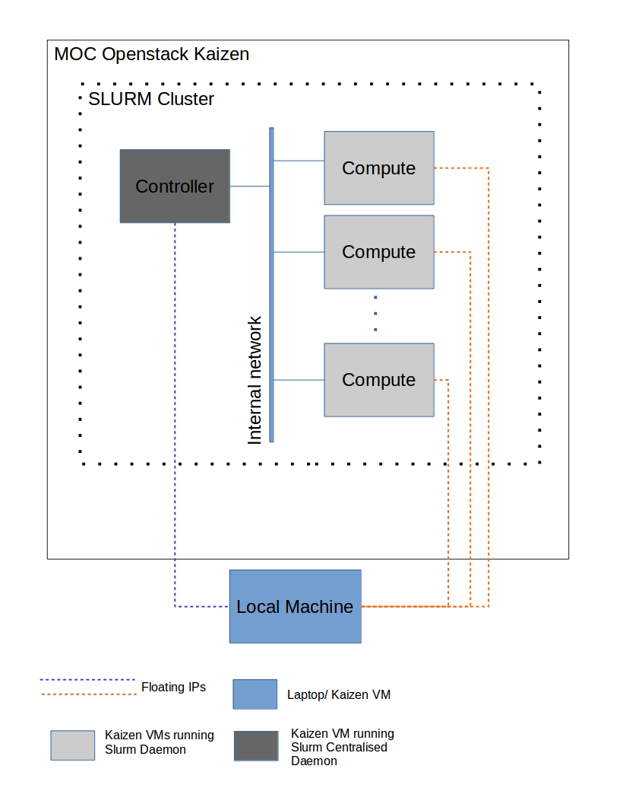

# Current Slurm Deployment
*Updated Slurm cluster layout can be found [here](https://github.com/CCI-MOC/hpc/wiki/Current-Slurm-cluster)*

This page talks about the current SLURM system we can deploy using the existing script. These scripts and findings from these configurations will be used to deploy SLURM cluster using BMI and HAAS on baremetal nodes. That part is yet to be worked on.    

The current scripts assumes you are deploying the SLURM cluster using CentOS 7 operating system on MOC's kaizen VMs.  
  
### Prerequisites to run these scripts
1. A VM or your local machine that can SSH into the kaizen VMs (used as the Controller/Compute node).  
2. Every kaizen VM (node) brought up should be reachable by other Nodes (i.e Controller/Compute nodes) especially by the Controller node and by the machine described in the 1st prerequisite (This is possible by assigning floating ip).  
3. The nodes which are used by the SLURM cluster should be running CentOS 7 operating system.
  
The current system uses the local machine or a VM on kaizen (so forth called local machine throughout this document) that can reach every other node in the SLURM cluster. The script is run on this local machine.  
  
The following shows the current SLURM cluster deployment architecture:

  
  
The deployment scripts are run on the local machine seen in the diagram, this deployment scripts installs the necessary packages and starts the particular daemon (central daemon or daemon) on the node.

The SLURM cluster communicates over the internal network, whereas to install the packages the local machine communicates with the VMs using the floating ips.  
  
After the prerequisites are met and a VM is available on kaizen, depending on script run on the local machine the VMs will be configured with the necessary configurations.  
  
1. From the local machine run the start_controller_node.sh/start_compute_node.sh script

        ./start_controller_node.sh floating_ip_of_the_instance type_of_controller  
  
where, `type_of_controller` can be either new/backup and `floating_ip_of_the_instance` is the ip address of node that the local machine uses to ssh into the node.  
  
        ./start_compute_node.sh floating_ip_of_the_instance partition_name  
  
where, `floating_ip_of_the_instance` is the ip address of node that the local machine uses to ssh into the node and partition_name is the name of the partition the node is to be assigned.  
  
Running these commands takes care of installing all the packages, editing the SLURM configuration file and running the SLURM daemon on the node. The Master/Controller node should brought up first.

The script keeps track of the nodes and there ip addresses from the file `ip_address.txt` present in the directory where the scripts are present.

