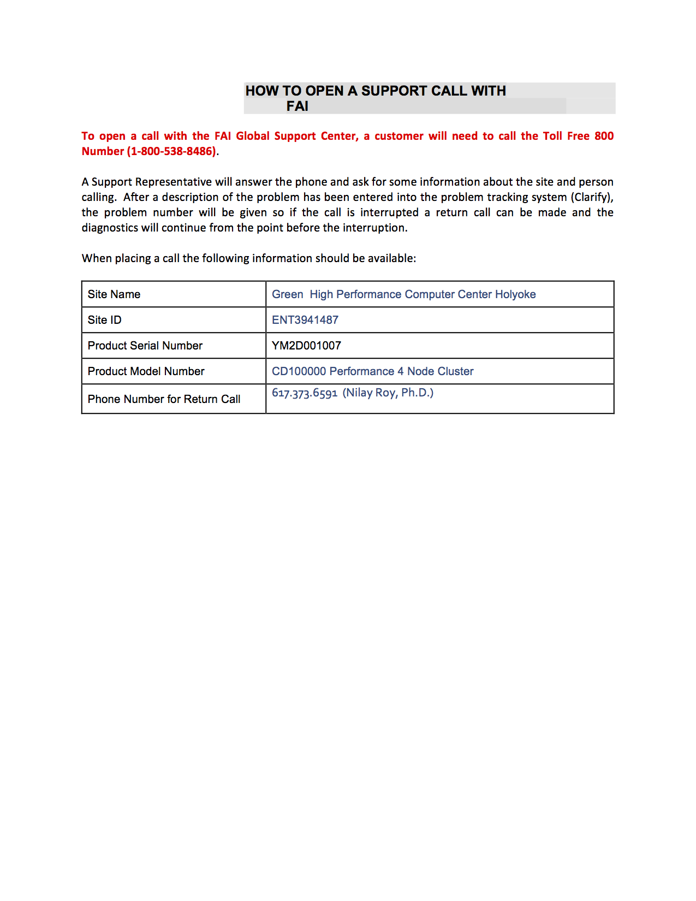

# Fujitsu CD10000

### Login Info
  
**Web URL** : https://129.10.3.253/dashboard (note - web server no longer responding on this address)
  
**User/Password** : bitwarden Fujitsu CD10000 User

**SSH User/Password** : bitwarden Fujitsu CD10000 SSH User

### IPMI

**IPMI of the management server** : 10.99.1.14 (accessible via HIL master or emergency box)

* current user/password: bitwarden Fujitsu CD10000 Management

**IPMI of the individual nodes**: 192.168.10.11-14 which (accessible from the management server, brocade 1g switches vlan 10 in fujitsu appliance cage)

* current user/password is still set at the default, see bitwarden Fujitsu CD10000 Nodes
* those should be accessible from haas-master after 7/13 visit

### Documentation 
* User guide can be found at [Link](_static/cd10000-ug-en_v1.0SP2.pdf)
* Spreadsheet layout of the CD10K deployment [Link](_static/xlsx/MOC_CD10K_Master_Worksheet_052915_DM.xlsx)
* System Admin training material can be found at [Link]<!--(CD10000-MOC-Training.7z)-->

### How to open a support call to Fujitsu 

**Via Phone** (all high priority issues)



**Via Web** (low priority issues only)
* [Link](https://iportal.shopfujitsu.com/portal/page/portal/EnterpriseCustomerPortal/Home)
* The first prompt will ask for serial number. YM2D001007 is the serial number for your CD10000. This information can be displayed with the following command when executed on the CD10000 management node:

```
[root@pmgmt ~]# cd10000 ip cluster show
+------------+--------------------+--------------------+-----------------+-----------------+-----------------+
| Cluster SN | Management node SN | Administration net |     IRMC net    |   Cluster net   |    Switch net   |
+------------+--------------------+--------------------+-----------------+-----------------+-----------------+
| YM2D001007 |     YM2H001033     |  192.168.20.0/23   | 192.168.10.0/23 | 192.168.40.0/23 | 192.168.50.0/23 |
+------------+--------------------+--------------------+-----------------+-----------------+-----------------+
```

### Networking 
There are three networks on CD10000's switch. The storage nodes are on all three networks; anything else on those networks is explicitly noted.   

**192.168.20.0/24**

* 2 bonded 1G ethernet
* Connects to CD10000 management node
  
**192.168.28.0/24** 

* 2 bonded 10G ethernet
* Connects to main switch; user data plane
  
**192.168.40.0/24**  

* 2 bonded infiniband
* internal Ceph data transfer

**192.168.50.11**

* brocade 1G stack of 2 switches

```
telnet@br001>sh vlan
Total PORT-VLAN entries: 3
Maximum PORT-VLAN entries: 64

Legend: [Stk=Stack-Id, S=Slot]

PORT-VLAN 1, Name DEFAULT-VLAN, Priority level0, Spanning tree On
 Untagged Ports: (U1/M3)   3   4   5   6   7   8
 Untagged Ports: (U2/M3)   3   4   5   6   7   8
   Tagged Ports: None
   Uplink Ports: None
 DualMode Ports: (U1/M1)   1   2
 DualMode Ports: (U1/M3)   1   2
 DualMode Ports: (U2/M1)   1   2
 DualMode Ports: (U2/M3)   1   2
 Mac-Vlan Ports: None
     Monitoring: Disabled
PORT-VLAN 10, Name [None], Priority level0, Spanning tree On
 Untagged Ports: (U1/M1)   7   8   9  10  11  12  13  14  15  16  17  18
 Untagged Ports: (U1/M1)  19  20
 Untagged Ports: (U2/M1)   7   8   9  10  11  12  13  14  15  16  17  18
 Untagged Ports: (U2/M1)  19  20
   Tagged Ports: (U1/M1)   1   2
   Tagged Ports: (U1/M3)   1   2
   Tagged Ports: (U2/M1)   1   2
   Tagged Ports: (U2/M3)   1   2
   Uplink Ports: None
 DualMode Ports: None
 Mac-Vlan Ports: None
     Monitoring: Disabled
PORT-VLAN 20, Name [None], Priority level0, Spanning tree On
 Untagged Ports: (U1/M1)   3   4   5   6  21  22  23  24  25  26  27  28
 Untagged Ports: (U1/M1)  29  30  31  32  33  34  35  36  37  38  39  40
 Untagged Ports: (U1/M1)  41  42  43  44  45  46  47  48
 Untagged Ports: (U2/M1)   3   4   5   6  21  22  23  24  25  26  27  28
 Untagged Ports: (U2/M1)  29  30  31  32  33  34  35  36  37  38  39  40
 Untagged Ports: (U2/M1)  41  42  43  44  45  46  47  48
   Tagged Ports: (U1/M1)   1   2
   Tagged Ports: (U1/M3)   1   2
   Tagged Ports: (U2/M1)   1   2
   Tagged Ports: (U2/M3)   1   2
   Uplink Ports: None
 DualMode Ports: None
 Mac-Vlan Ports: None
     Monitoring: Disabled


telnet@br001>sh ru
Current configuration:
!
ver 08.0.10dT7f1
!
stack unit 1
  module 1 icx6610-48-port-management-module
  module 2 icx6610-qsfp-10-port-160g-module
  module 3 icx6610-8-port-10g-dual-mode-module
  priority 10
  stack-trunk 1/2/1 to 1/2/2
  stack-trunk 1/2/6 to 1/2/7
  stack-port 1/2/1 1/2/6
stack unit 2
  module 1 icx6610-48-port-management-module
  module 2 icx6610-qsfp-10-port-160g-module
  module 3 icx6610-8-port-10g-dual-mode-module
  stack-trunk 2/2/1 to 2/2/2
  stack-trunk 2/2/6 to 2/2/7
  stack-port 2/2/1 2/2/6
stack enable
stack mac cc4e.24bc.ede0
!
!
!
lag "mngmnt1" dynamic id 1
 ports ethernet 1/1/1 ethernet 2/1/1
 primary-port 1/1/1
 force-up ethernet 1/1/1
 deploy
!
lag "mngmnt2" dynamic id 2
 ports ethernet 1/1/2 ethernet 2/1/2
 primary-port 1/1/2
 force-up ethernet 1/1/2
 deploy
!
lag "trunk1" dynamic id 3
 ports ethernet 1/1/21 ethernet 2/1/21
 primary-port 1/1/21
 force-up ethernet 1/1/21
 deploy
!
lag "trunk10" dynamic id 12
 ports ethernet 1/1/30 ethernet 2/1/30
 primary-port 1/1/30
 force-up ethernet 1/1/30
 deploy
!
lag "trunk11" dynamic id 13
 ports ethernet 1/1/31 ethernet 2/1/31
 primary-port 1/1/31
 force-up ethernet 1/1/31
 deploy
!
lag "trunk12" dynamic id 14
 ports ethernet 1/1/32 ethernet 2/1/32
 primary-port 1/1/32
 force-up ethernet 1/1/32
 deploy
!
lag "trunk13" dynamic id 15
 ports ethernet 1/1/33 ethernet 2/1/33
 primary-port 1/1/33
 force-up ethernet 1/1/33
 deploy
!
lag "trunk14" dynamic id 16
 ports ethernet 1/1/34 ethernet 2/1/34
 primary-port 1/1/34
 force-up ethernet 1/1/34
 deploy
!
lag "trunk15" dynamic id 17
 ports ethernet 1/1/35 ethernet 2/1/35
 primary-port 1/1/35
 force-up ethernet 1/1/35
 deploy
!
lag "trunk16" dynamic id 18
 ports ethernet 1/1/36 ethernet 2/1/36
 primary-port 1/1/36
 force-up ethernet 1/1/36
 deploy
!
lag "trunk17" dynamic id 19
 ports ethernet 1/1/37 ethernet 2/1/37
 primary-port 1/1/37
 force-up ethernet 1/1/37
 deploy
!
lag "trunk18" dynamic id 20
 ports ethernet 1/1/38 ethernet 2/1/38
 primary-port 1/1/38
 force-up ethernet 1/1/38
 deploy
!
lag "trunk19" dynamic id 21
 ports ethernet 1/1/39 ethernet 2/1/39
 primary-port 1/1/39
 force-up ethernet 1/1/39
 deploy
!
lag "trunk2" dynamic id 4
 ports ethernet 1/1/22 ethernet 2/1/22
 primary-port 1/1/22
 force-up ethernet 1/1/22
 deploy
!
lag "trunk20" dynamic id 22
 ports ethernet 1/1/40 ethernet 2/1/40
 primary-port 1/1/40
 force-up ethernet 1/1/40
 deploy
!
lag "trunk21" dynamic id 23
 ports ethernet 1/1/41 ethernet 2/1/41
 primary-port 1/1/41
 force-up ethernet 1/1/41
 deploy
!
lag "trunk22" dynamic id 24
 ports ethernet 1/1/42 ethernet 2/1/42
 primary-port 1/1/42
 force-up ethernet 1/1/42
 deploy
!
lag "trunk23" dynamic id 25
 ports ethernet 1/1/43 ethernet 2/1/43
 primary-port 1/1/43
 force-up ethernet 1/1/43
 deploy
!
lag "trunk24" dynamic id 26
 ports ethernet 1/1/44 ethernet 2/1/44
 primary-port 1/1/44
 force-up ethernet 1/1/44
 deploy
!
lag "trunk25" dynamic id 27
 ports ethernet 1/1/45 ethernet 2/1/45
 primary-port 1/1/45
 force-up ethernet 1/1/45
 deploy
!
lag "trunk26" dynamic id 28
 ports ethernet 1/1/46 ethernet 2/1/46
 primary-port 1/1/46
 force-up ethernet 1/1/46
 deploy
!
lag "trunk27" dynamic id 29
 ports ethernet 1/1/47 ethernet 2/1/47
 primary-port 1/1/47
 force-up ethernet 1/1/47
 deploy
!
lag "trunk28" dynamic id 30
 ports ethernet 1/1/48 ethernet 2/1/48
 primary-port 1/1/48
 force-up ethernet 1/1/48
 deploy
!
lag "trunk3" dynamic id 5
 ports ethernet 1/1/23 ethernet 2/1/23
 primary-port 1/1/23
 force-up ethernet 1/1/23
 deploy
!
lag "trunk4" dynamic id 6
 ports ethernet 1/1/24 ethernet 2/1/24
 primary-port 1/1/24
 force-up ethernet 1/1/24
 deploy
!
lag "trunk5" dynamic id 7
 ports ethernet 1/1/25 ethernet 2/1/25
 primary-port 1/1/25
 force-up ethernet 1/1/25
 deploy
!
lag "trunk6" dynamic id 8
 ports ethernet 1/1/26 ethernet 2/1/26
 primary-port 1/1/26
 force-up ethernet 1/1/26
 deploy
!
lag "trunk7" dynamic id 9
 ports ethernet 1/1/27 ethernet 2/1/27
 primary-port 1/1/27
 force-up ethernet 1/1/27
 deploy
!
lag "trunk8" dynamic id 10
 ports ethernet 1/1/28 ethernet 2/1/28
 primary-port 1/1/28
 force-up ethernet 1/1/28
 deploy
!
lag "trunk9" dynamic id 11
 ports ethernet 1/1/29 ethernet 2/1/29
 primary-port 1/1/29
 force-up ethernet 1/1/29
 deploy
!
!
vlan 1 name DEFAULT-VLAN by port
!
vlan 10 by port
 tagged ethe 1/1/1 to 1/1/2 ethe 1/3/1 to 1/3/2 ethe 2/1/1 to 2/1/2 ethe 2/3/1 to 2/3/2
 untagged ethe 1/1/7 to 1/1/20 ethe 2/1/7 to 2/1/20
!
vlan 20 by port
 tagged ethe 1/1/1 to 1/1/2 ethe 1/3/1 to 1/3/2 ethe 2/1/1 to 2/1/2 ethe 2/3/1 to 2/3/2
 untagged ethe 1/1/3 to 1/1/6 ethe 1/1/21 to 1/1/48 ethe 2/1/3 to 2/1/6 ethe 2/1/21 to 2/1/48
!
!
!
!
enable super-user-password .....
hostname br001
ip address 192.168.50.11 255.255.254.0
no ip dhcp-client enable
!
telnet client 192.168.50.1
telnet server enable vlan 20
snmp-server community ..... ro
snmp-server enable vlan 20
snmp-server host 192.168.50.1 version v2c .....
!
!
!
!
ntp
 disable serve
 server 192.168.50.1 burst
!
!
snmp-client 192.168.50.1
web client 192.168.50.1
no web-management http
hitless-failover enable
interface ethernet 1/1/1
 dual-mode
 no spanning-tree
!
interface ethernet 1/1/2
 dual-mode
 no spanning-tree
!
interface ethernet 1/1/3
 no spanning-tree
!
interface ethernet 1/1/4
 no spanning-tree
!
interface ethernet 1/1/5
 no spanning-tree
!
interface ethernet 1/1/6
 no spanning-tree
!
interface ethernet 1/1/7
 no spanning-tree
!
interface ethernet 1/1/8
 no spanning-tree
!
interface ethernet 1/1/9
 no spanning-tree
!
interface ethernet 1/1/10
 no spanning-tree
!
interface ethernet 1/1/11
 no spanning-tree
!
interface ethernet 1/1/12
 no spanning-tree
!
interface ethernet 1/1/13
 no spanning-tree
!
interface ethernet 1/1/14
 no spanning-tree
!
interface ethernet 1/1/15
 no spanning-tree
!
interface ethernet 1/1/16
 no spanning-tree
!
interface ethernet 1/1/17
 no spanning-tree
!
interface ethernet 1/1/18
 no spanning-tree
!
interface ethernet 1/1/19
 no spanning-tree
!
interface ethernet 1/1/20
 no spanning-tree
!
interface ethernet 1/1/21
 no spanning-tree
!
interface ethernet 1/1/22
 no spanning-tree
!
interface ethernet 1/1/23
 no spanning-tree
!
interface ethernet 1/1/24
 no spanning-tree
!
interface ethernet 1/1/25
 no spanning-tree
!
interface ethernet 1/1/26
 no spanning-tree
!
interface ethernet 1/1/27
 no spanning-tree
!
interface ethernet 1/1/28
 no spanning-tree
!
interface ethernet 1/1/29
 no spanning-tree
!
interface ethernet 1/1/30
 no spanning-tree
!
interface ethernet 1/1/31
 no spanning-tree
!
interface ethernet 1/1/32
 no spanning-tree
!
interface ethernet 1/1/33
 no spanning-tree
!
interface ethernet 1/1/34
 no spanning-tree
!
interface ethernet 1/1/35
 no spanning-tree
!
interface ethernet 1/1/36
 no spanning-tree
!
interface ethernet 1/1/37
 no spanning-tree
!
interface ethernet 1/1/38
 no spanning-tree
!
interface ethernet 1/1/39
 no spanning-tree
!
interface ethernet 1/1/40
 no spanning-tree
!
interface ethernet 1/1/41
 no spanning-tree
!
interface ethernet 1/1/42
 no spanning-tree
!
interface ethernet 1/1/43
 no spanning-tree
!
interface ethernet 1/1/44
 no spanning-tree
!
interface ethernet 1/1/45
 no spanning-tree
!
interface ethernet 1/1/46
 no spanning-tree
!
interface ethernet 1/1/47
 no spanning-tree
!
interface ethernet 1/1/48
 no spanning-tree
!
interface ethernet 1/3/1
 dual-mode
!
interface ethernet 1/3/2
 dual-mode
!
interface ethernet 2/3/1
 dual-mode
!
interface ethernet 2/3/2
 dual-mode
!
!
!
!
!
!
ip ssh  client 192.168.50.1
!
!
end

telnet@br001>sh ver
  Copyright (c) 1996-2014 Brocade Communications Systems, Inc. All rights reserved.
    UNIT 1: compiled on Jul 25 2014 at 12:28:26 labeled as FCXS08010d
                (7267788 bytes) from Primary FCXS08010d.bin
        SW: Version 08.0.10dT7f1
    UNIT 2: compiled on Jul 25 2014 at 12:28:26 labeled as FCXS08010d
                (7267788 bytes) from Primary FCXS08010d.bin
        SW: Version 08.0.10dT7f1
  Boot-Monitor Image size = 370695, Version:10.1.00T7f5 (grz10100)
  HW: Stackable ICX6610-48
==========================================================================
UNIT 1: SL 1: ICX6610-48 48-port Management Module
         Serial  #: BXN3849K001
         License: BASE_SOFT_PACKAGE   (LID: dzpINJOmFFG)
         P-ENGINE  0: type E02B, rev 01
         P-ENGINE  1: type E02B, rev 01
==========================================================================
UNIT 1: SL 2: ICX6610-QSFP 10-port 160G Module
==========================================================================
UNIT 1: SL 3: ICX6610-8-port Dual Mode(SFP/SFP+) Module
==========================================================================
UNIT 2: SL 1: ICX6610-48 48-port Management Module
         Serial  #: BXN3849K002
         License: BASE_SOFT_PACKAGE   (LID: dzpINJOmFFH)
         P-ENGINE  0: type E023, rev 01
         P-ENGINE  1: type E023, rev 01
==========================================================================
UNIT 2: SL 2: ICX6610-QSFP 10-port 160G Module
==========================================================================
UNIT 2: SL 3: ICX6610-8-port Dual Mode(SFP/SFP+) Module
==========================================================================
  800 MHz Power PC processor 8544E (version 0021/0023) 400 MHz bus
65536 KB flash memory
  512 MB DRAM
STACKID 1  system uptime is 37 days 22 hours 10 minutes 44 seconds
STACKID 2  system uptime is 37 days 22 hours 10 minutes 42 seconds
The system started at 00:11:37 GMT+00 Wed May 24 2017

 The system : started=cold start
My stack unit ID = 1, bootup role = active
```

