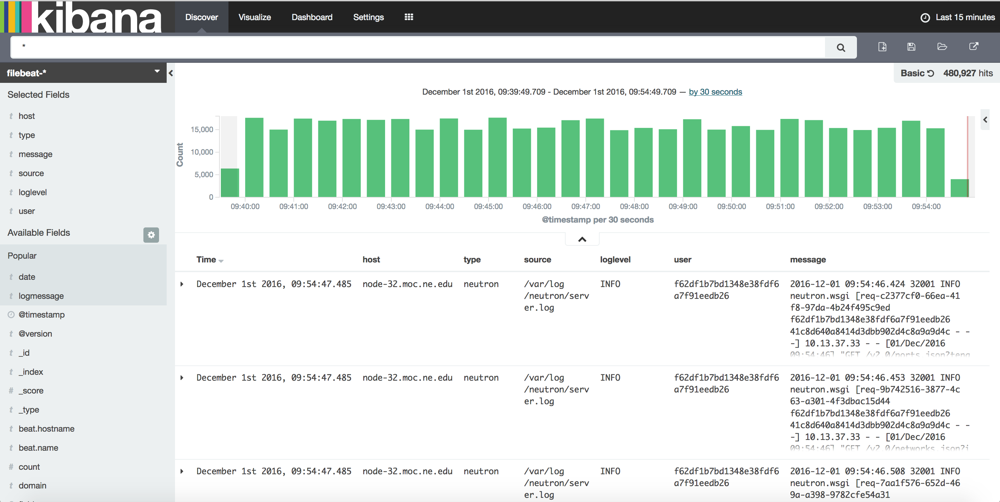
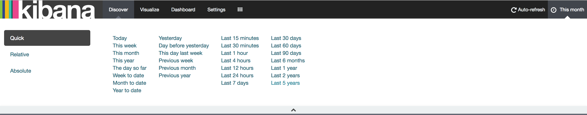
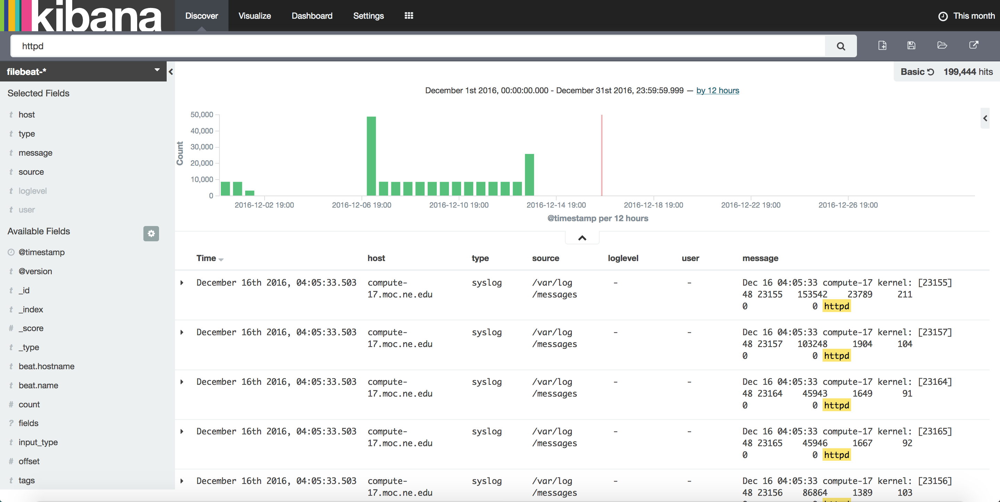
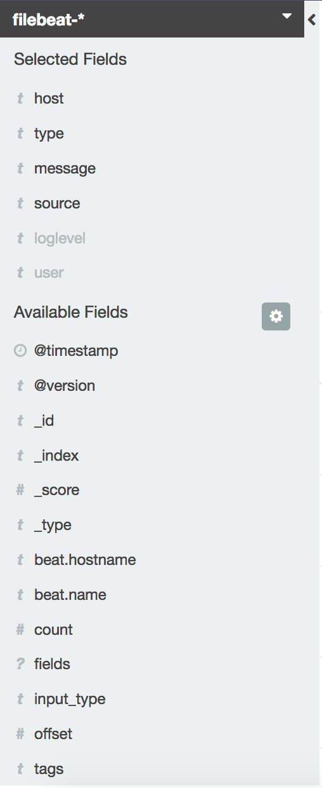
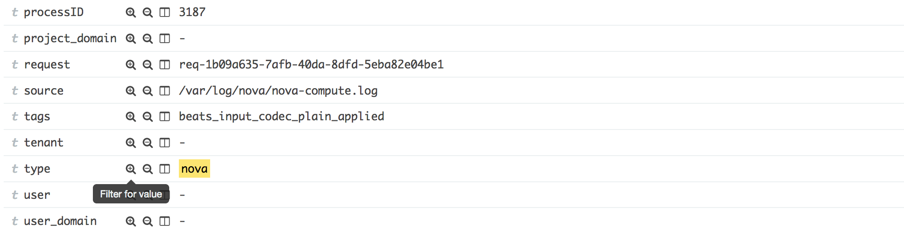
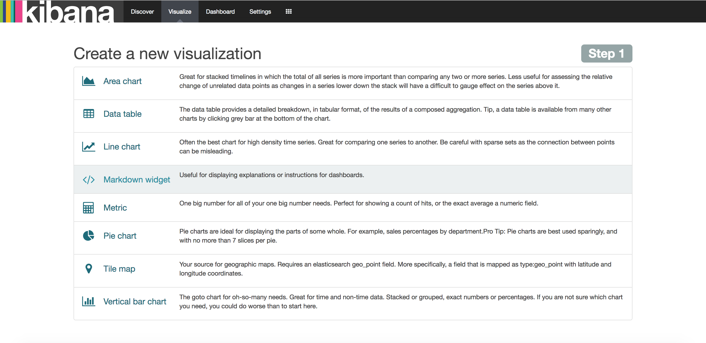
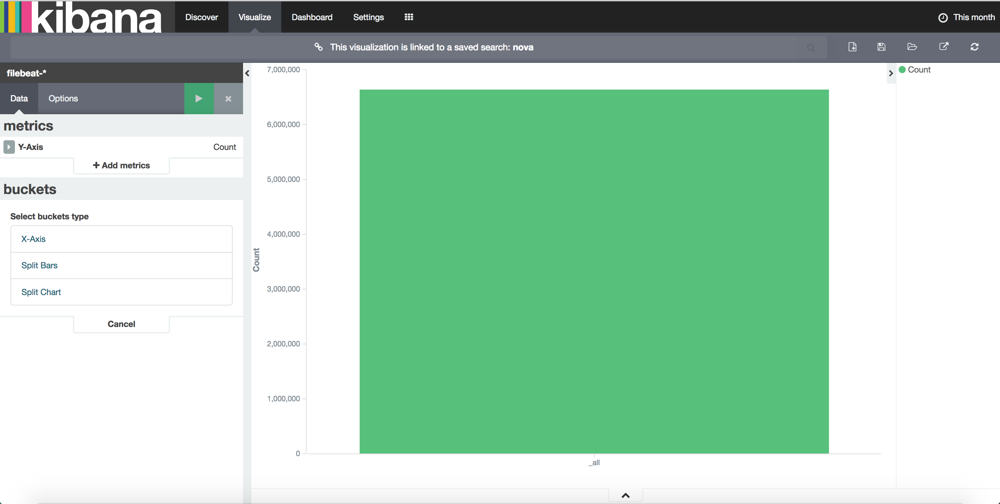
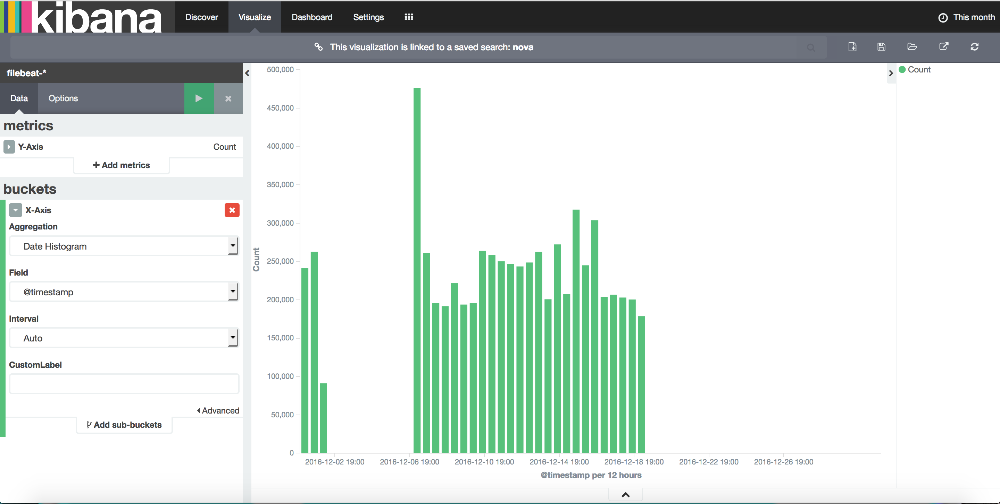
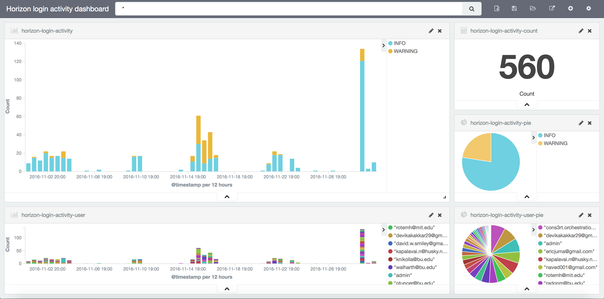

# How to Use Production Kibana

### Discovering Data
Click `Discover` in the top navigation bar to display Kibana’s data discovery functions:

### Time Range
You could specify the time range by clicking the clock button at the upper right corner.

### Query Bar
In the query bar, you can enter an [Elasticsearch query](https://www.elastic.co/guide/en/elasticsearch/reference/5.1/query-dsl-query-string-query.html#query-string-syntax) to search your data.

For an example, if you want to see all log messages that contain key word "httpd" in this month. Just enter "httpd" in the search bar, select time range to be "this month" and click enter. The result is as follows:

### Fields
Fields let us easily find logs we want because we could search by specific field values. The kibana fields side panel is as follows:

The fields contains not only the default fields such as 'Time', 'source' and also some fields added when we parse the logs in logstash. 

To choose which document fields to display, hover over the Available Fields list and click the add button next to each field you want include.

In our production kibana dashboard the fields are: `Time`, `host`, `type`, `source`, `loglevel`, `user`, `message`.

You could easily search for logs with particular field value. For an example, we want to see all nova logs. Thanks to filebeat, all logs collected from nova services are marked with a field called "type" and the value is "nova".

Firstly find an nova log message in the main panel, click the small triangle located at the right side to see details of this log message.

In the drop down panel, find the `type` field and click the `+` sign to filter for this value. As show in the following picture.

You could combine other fields together by this way to make more sophisticated search. Once you are done, you could click the save search button on the upper right corner of the page to save this search pattern.

### Visualizing Data
To start visualize your data, click 'Visualize' in the top navigation bar.

The Visualize tools enable you to view your data in several ways. 

Let's make a vertical bar chart for a saved search called 'nova' we made earlier. In 'Create a new visualization ' list, select 'Vertical bar chart'. Then select 'From a saved search'. In the drop down list find and select the search we made earlier which called 'nova'.

You will see a window similar as the following:

Then specify Y-axis as 'Count'. Specify 'buckets' as 'X-Axis' and 'Aggregation' as 'Date Histogram'. Click the green 'Apply changes' button to view the results. The results should be similar with follows:

This diagram shows how many nova logs are collected over time.

Click the 'Save Visualization' button located at the upper right corner of the page and give it a title like 'nova log count'. Click 'Save' and you are done!

You could find all saved diagrams in the 'Load Saved Visualization' button located next to the 'save' button at the upper right corner.

### Putting it all Together with Dashboards
A dashboard is a collection of visualizations that you can arrange and share. Click the 'Dashboard' button located at the top navigation bar you will enter the dashboard panel.

To find all dashboards that already created for you, click the 'Load Saved Dashboard' button at the upper right corner.

To build a dashboard that contains the visualizations that saved before:
* Click Dashboard in the top navigation.
* Click 'Add Visualization' to display the list of saved visualizations.
* Click all the saved visualizations that you want to display in this dashboard, then close the list of visualizations by clicking the small up-arrow at the bottom of the list.
* Hovering over a visualization displays the container controls that enable you to edit, move, delete, and resize the visualization.

Your sample dashboard should end up looking roughly like this:

