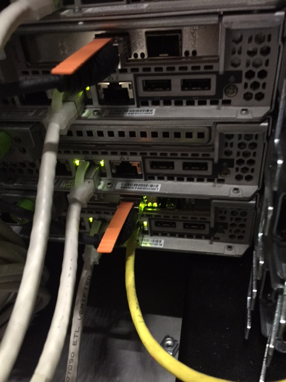
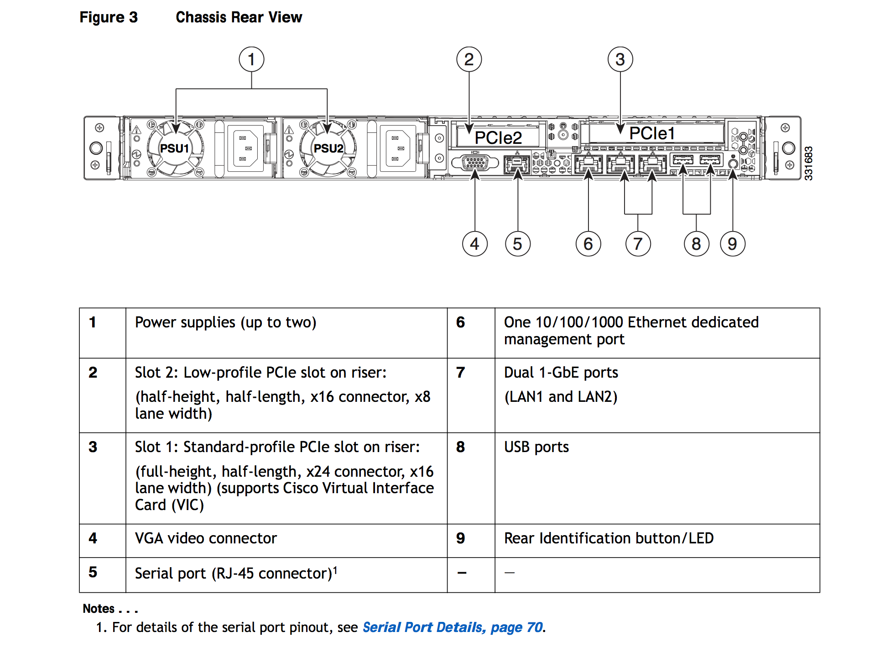
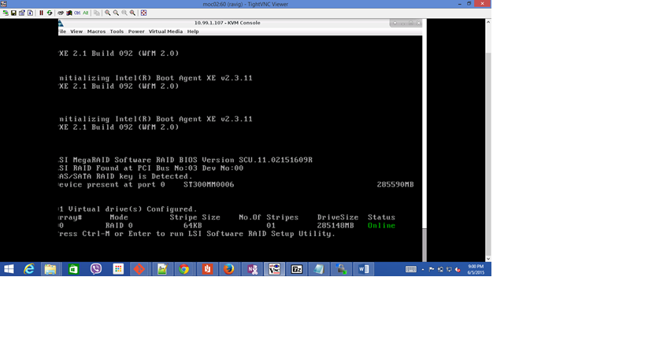

# Icehouse RHEL 7.0 Deployment Experimentation
It's confirmed that the embedded driver is unsupported on Red Hat 7.0 on the UCS servers. After discussing with CSAIL and Red Hat, we will deploy Kilo/RHEL OSP instead of Icehouse/Red Hat 7.0. 

The goal is to deploy Red Hat 7.0 on the UCS servers. The UCS servers have embedded Raid driver using Intel C600 Mega Raid driver.
 
##Issue
Bootloader/installer do(es) not work with the embedded raid driver on the UCS servers.

Three approaches we are pursuing: 
1. using the same method as previously done by NU IT engineer who was able to deploy 6.4 on the UCS server. The record stated that combining the driver ISO and the OS ISO worked. Details on this attempt/experimentation is on this wiki page. [Sahil/Apoorve/Ravi]
2. deploy using non Grub bootloader. The raid driver does not work so well with Grub. We found syslinux (instead of grub) to at least allow us to deploy Red Hat 7.1
3. disk-less method. TBD

******
### Updates

  **(06/12/2015) - Ravi** 

The CentOS 6.5 Image which sahil prepared is not showing the image file for drivers but it seems that it included the drivers image file. 

Today, we proceeded with installation eventhough its not showing up there in text mode and finally it did partitions and started installation. This is pending validation.

  **(06/10/2015 & 06/11/2015) - Sahil** 
  
Following are the approaches I tried for installing Centos 6.5 and Centos 6.3 using the drivers provided in the patch ucs-cxxx-drivers.2.0.4a.iso
* Mapped drivers (.img files) and iso as virtual disk. Status: FAIL
* CIMC could not map another virtual disk other than the OS iso, Combined iso of the OS and the drivers. Status: FAIL
* Connected iso having OS and driver as a virtual drive. At the stage of installation where it asks to select the driver to be loaded, when I selected the virtual device containing the OS and driver, it showed me all the files in it except the the <driver>.img file. This happened for both Centos6.3 and its corresponding driver and Centos6.5 and its corresponding driver
* Loaded a physical DVD with OS and driver burned image on it. Status: FAIL

OS installation procedure gets loaded correctly.
At the stage of selecting the location of driver, when I select the same DVD as location, it shows the following message.

* OS as virtual disk (.iso) and drivers burned on  a CD (only the .img file). status: FAIL
* On trying to select the DVD for the location of the driver, I again got the same error as above.

  **06/09/2015 - Sahil**

Today I, Apoorve and Ravi were troubleshooting the issue of installing RH7.0 on the Cisco Server. The actual behaviour of CIMC does not match with the provided documentation. It took us multiple rounds of trying different approaches to figure out what actually works. 

The current status is as follows: A new set of drivers 'ucs-cxxx-drivers.2.0.4a.iso' were released by Cisco for its server (UCS C220 M3 SFF) on 05 June 2015. 

The interoperability matrix shows that it supports upto RH7.1 but when I looked into the iso, it clearly mentions that there is not support for RH 7.0. 

Out idea was to install the server with the RH version that works and then upgrade it to RH7.0

Procedure for installing new drivers on the server using CIMC includes adding both virtual images (OS and <driver>.img) as virtual devices. But for some reason, CIMC is not able to map the <dirver>.img as a virtual device.

We tried mapping it as a virtual floppy drive which was accepted by CIMC but it seems the newer versions of RH OS no longer support floppy disks, hence we could find any way of locating and installing the driver, when it was attached as a virtual floppy disk. 

Also the command line arguments to invoke the installation of driver were not correct as per the documentation. With the help of Nilay we figured out the correct options to invoke that action. 

Trying to burn the OS iso and driver image together as a single iso also gave errors. We will have to try that again. 

 **06/07/2015 - Piyanai**

Summary of blocking items to date:
* HaaS : Unable to create HaaS Mater. The current version of the VLAN Trunking software assumes one switch. The UCS servers are deployed with two switches. The design of the refactoring version software does not have this restriction. The time estimate to have the refactoring version done is 2.5 weeks (Ian). 
* Unable to install REL 7.0 on any of the UCS servers because of an unusable version of the Raid controller driver (Intel C600 Mega Raid driver)
We believe the Intel driver causes installers to fail with "cannot create aligned partition" on Centos/RHEL 6.6/7.0 installers (all four combinations). A Red Hat [#01456198](https://access.redhat.com/support/cases/#/case/01456198) case was filed. Rajiv (NU) also filed a Cisco case <SR 635171565>. 

On the Ubuntu 14.04 system installed by Jay, Ravi installed the MegaCLI utility. The utility shows the SAS hard disk drive model number <ST300MM0006>, but no controllerdriver information was listed. See Ravi's full report below (06/05/2015 section).

The other two distros which have been installed succesfully are Arch Linux (by both Ian and George), and OpenSUSE (by George).

One option to consider is to remove the Raid controller from the equation altogether. This would require storage re-wiring of all 48 servers. 

Incorrect network wiring on the UCS servers to the OBM switches.  This means that any machine has access to every single machine's OBM, which is a serious security problem.

As shown in this back plane of the UCS servers photo provided by NU, the dedicated management ports do not have any cable plugged in. 

The image of the full back plane of the UCS server is also provided next. The image was taken from page 7 of the [UCS C220-M3S Spec. Sheet](https://www.cisco.com/c/dam/en/us/products/collateral/servers-unified-computing/ucs-c-series-rack-servers/C220M3_SFF_SpecSheet.pdf).

  **06/05/2015 - Ravi**

Issues
* As of now, we are not able to install Redhat family OS on the Cisco gear. The issue could be with the Intel Embedded SW MegaRAID Controller which we are using. We tried installing MegaCLI which could identify the adapter version of Controller but it was not identifying the controller on 06 box. - WIP
* As per the Cisco UCS install guide, we cannot install any hypervisor Operating systems on the H/W if we are using Embedded controller?

[Reference](http://www.cisco.com/c/en/us/td/docs/unified_computing/ucs/c/hw/C220/install/C220.pdf) check for the section - Embedded MegaRAID Controller

So, even if we are able to upgrade the adapter driver to support RHEL, this could cause issues when we want to provision VMs on them?

### Other Links
* [Raid Firmware Upgrade](http://www.cisco.com/c/en/us/td/docs/unified_computing/ucs/c/hw/C220/install/C220/raid.pdf)
* [Certification Matrix](http://www.cisco.com/c/dam/en/us/td/docs/unified_computing/ucs/interoperability/matrix/m_hcl_C_rel2-03.pdf)
* [BIOS Firmware upgrade](http://www.cisco.com/c/en/us/td/docs/unified_computing/ucs/c/sw/lomug/2-0-x/b_huu_2_0_3.html) - Tool that could be used for firmware upgrade:(Server Level)

