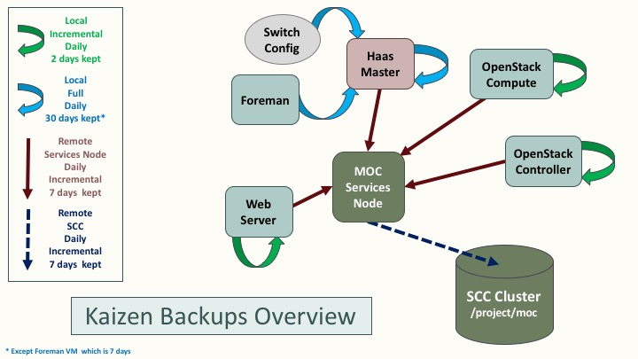

# Kaizen Backups Overview

Backups of the MOC Kaizen cluster are handled by a set of lightweight bash scripts which use rsync.  

The advantage of using rsync and bash is portability - it is easy to include a wide variety of nodes and instances using the same set of base scripts.

### Components

  **OpenStack Nodes** :
  * Puppet handles installation of the backup scripts on OpenStack controller and compute nodes
  * Class 'backups' is defined in `puppet:///modules/quickstack/manifests/backups.pp`
  * The class is declared in controller_common.pp and compute_common.pp
  * The class declaration is essentially the same for both controller and compute, but a different script is installed. The different scripts are stored in `puppet://modules/quickstack/files/` and are customized for the specific type of node.
  * Puppet configures a backup user with appropriate authorized_keys file and limited sudo permissions.
  * Puppet also installs the local backup script and the root cronjob that runs it.

  **Non-OpenStack Nodes** :
  * There is generic version of the local backup script which can be configured for any node or VM, even those not managed by Puppet.
  * Currently, the script, user, cronjob, authorized_keys, etc must be installed manually for non-Puppet nodes.
  * The MOC website is currently backed up using this generic script.

  **Haas Master, Foreman, and Switches** :
  * The haas master database is backed up daily.
  * Foreman is backed up by cloning the VM.
  * A static backup exists of the switch config.
  * Currently, none of the backups taking place on the haas master are incremental; there are plans to improve this.

### Backup Collection
* The collection script and cronjob are installed manually on any machine designated as a collection node. 
* Currently, backups are collected on the Services Node.
* The last 8 days of backups are stored.  This can be changed by editing the following line in `collect_backups.sh`\:
     `DELETE_DAY="$(date -d '8 days ago' -I)"`

### "Offsite" Collection
* [WORK IN PROGRESS] An additional incremental backup is made from the Services Node to BU's SCC cluster.
* Note that while this is a backup to a completely separate system, controlled by a different university, it technically *isn't* an offsite backup since the SCC cluster is also located at MGHPCC (although in a different pod).

### How the scripts work
* Local backup scripts are run once per day, and create a daily incremental backup stored in `/backups/YYYY-MM-DD`.  This directory follows the same naming convention on every node.
* The oldest backup is deleted. To change how many backups are kept locally, configure this line within the relevant script\:
     `DELETE_DATE="$(date -d '2 days ago' -I)"`
* The collection nodes run a collection script, also once per day,
     * **NOTE: It is important that the collection script run AFTER that day's backups.**
* The cronjob is configured to log to a file, but also email any stderr output to kaizen@lists.massopen.cloud, so that we will be alerted if any backup fails.

******
### To-Do List / Suggestions for improvement

  **General** :
  * Investigate whether rdiff would offer more efficient backups
  * create a helper script to handle backup script installation on non-puppetized nodes
  * Review where encryption is needed and add/remove as necessary
  * Further parameterize the backup scripts:
     * number of days worth of backups
     * verbose logging / dry run (rsync args)
  * Investigate [Freezer](https://wiki.openstack.org/wiki/Freezer) to see if this is something we can use in the future if/when they support Ceph

  **Collection nodes** :
  * Puppetize installation of the collection scripts on the Openstack services nodes
  * automate updating known_hosts if a new node is added
  * mechanism to communicate the current hypervisor list to collection nodes - this would eliminate the need to eliminating the need to add new physical nodes to the collection script manually
  * Design a way to automate adding a new collection node's public key when is not configured by puppet.
 
  **Haas Master + associated** : 
  * Standardize backups directory structure on haas-master to conform to the overall scheme.
  * Improve backups of the switch config
  * Use rsync and incremental backups for the Foreman VM (either instead of or in addition to the VM clones)

******
### Updates
September 15, 2017 : Laura Kamfonik via email (9/12)

Backups [puppet module](https://github.com/CCI-MOC/kilo-puppet/blob/liberty/quickstack/manifests/backups.pp)

And the scripts it installs are in [this](https://github.com/CCI-MOC/kilo-puppet/tree/liberty/quickstack/files) directory: compute_backup.sh and controller_backup.sh

The collection script that runs on node 39 is [here](https://github.com/CCI-MOC/moc/blob/master/scripts/backup_scripts/collect_backups.sh)

Backups are first copied to the /backups directory on node 39, and then from there they are pulled to SCC.

