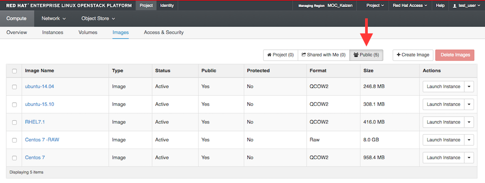
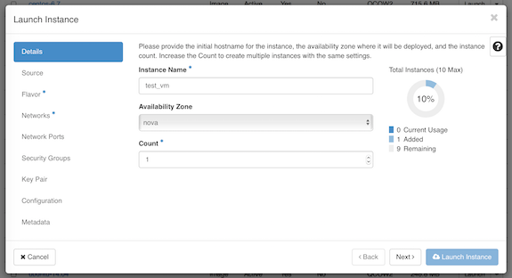
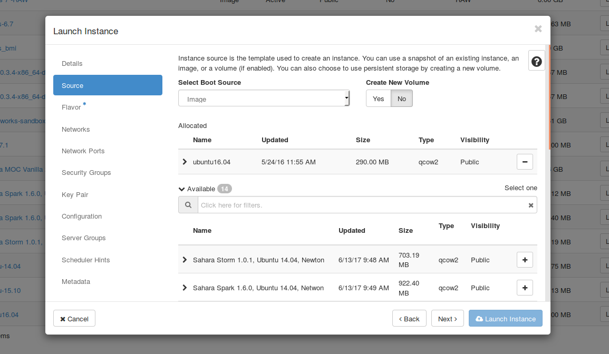
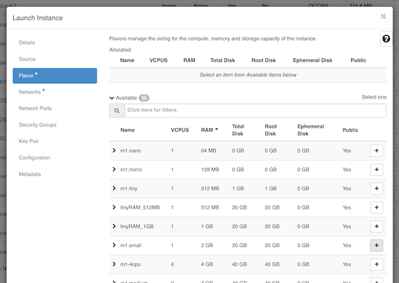
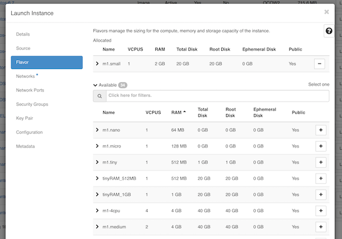
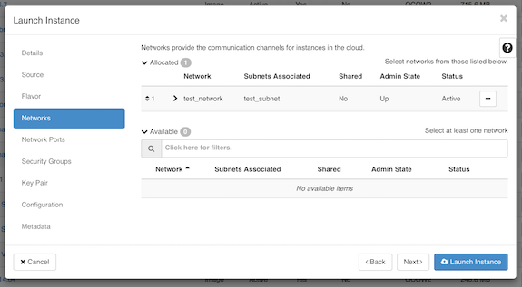
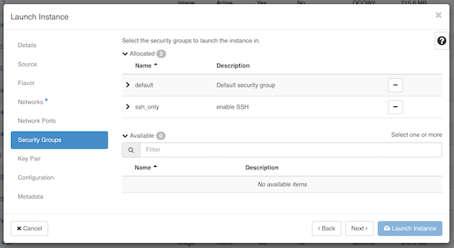
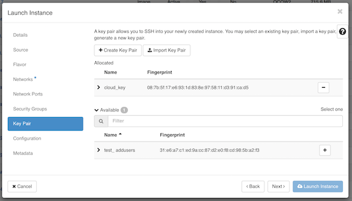
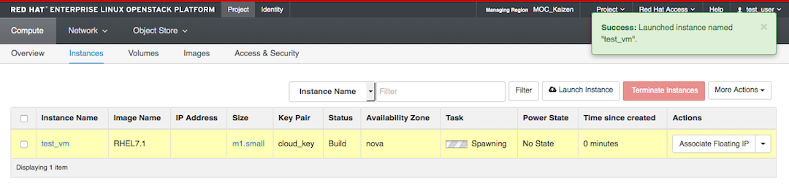
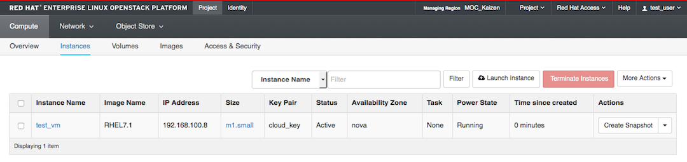

# Launch A VM

### Background

To start a VM, we will need a base image.  MOC has made several Public images available to users. 

### Launch an Instance
Navigate: Project -> Compute -> Images.  Make sure you are on the Public tab.

Click Launch Instance next to the public image of your choice.  In the example, we chose RHEL7.1.  

*Important: There are multiple tabs along the top of the the pop up window.

Make sure you review all of them as per instructions before clicking on Launch!  Otherwise, your launched VM may be inaccessible.*

Give your instance a name.

**Source**

Double check that in the dropdown "Select Boot Source," "Image" is selected.

To create an image that uses the boot volume sized according to the flavor ensure that "No" is selected under the "Create New Volume" section as shown here:

**Flavor**  

Choose m1.small from the 'Flavor' tab by clicking on the "+" icon.
 

The default m1.tiny flavor is too small for the base images which are available.

m1.small has enough resources for most purposes, so you should choose that unless you explicitly need more.  

If you find later that a custom flavor would help you use your resources more effectively, you can contact moc-kaizen-l@bu.edu to request that the admins create a new flavor.

After choosing m1.small, you should see it moved up to "Allocated".

**Networking**

Make sure the Private Network you just created is moved up to "Allocated". If not, you can click on the "+" icon in "Available".

**Security Groups**

Make sure to add the security group where you enabled SSH.

**Key Pair**

Add the key pair you want to use with this VM.

Openstack currently only supports adding a single key pair. We will discuss how to add additional public keys [later in the tutorial](SSH-to-Cloud-VM.html#more-ssh-keys).

**Configuration and Metadata**

Ignore these two tabs for now.

You are now ready to launch your VM - go ahead and click "Launch Instance"!

On a successful launch you would be redirected to Compute -> Instances tab  
and can see the VM spawning.  

Once your VM is successfully running you will see the **Power State** changes from
"No State" to "running".  

Good job!

******

Next: [Assign a Floating IP](Assign-a-Floating-IP.html)

Previous: [Create a Key Pair](Create-a-Key-Pair.html)

[Openstack Tutorial Index](OpenStack-Tutorial-Index.html)

