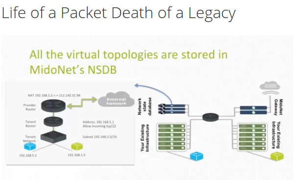

# Midonet
[RDO installation](https://www.rdoproject.org/networking/midonet-integration_mem-5-rhel-7-kilo-osp)

[Midonet with MOC Kilo Openstack](Midonet-with-openstack-Kilo-release-\(MOC-puppet-deployment\).html)

### Devstack installation
Ubuntu/redhat with 8 GB RAM and 4+ VCPUs.

```
$ git clone https://git.openstack.org/openstack-dev/devstack
$ cd devstack
```
Create a local.conf file and dump the below content to it.

```
#!/usr/bin/env bash

[[local|localrc]]
ADMIN_PASSWORD=password
DATABASE_PASSWORD=$ADMIN_PASSWORD
RABBIT_PASSWORD=$ADMIN_PASSWORD
SERVICE_PASSWORD=$ADMIN_PASSWORD
#FIXED_RANGE=172.31.1.0/24
#FLOATING_RANGE=192.168.20.0/25
HOST_IP=192.168.113.19

ENABLED_SERVICES=rabbit,mysql,key
ENABLED_SERVICES+=,n-api,n-crt,n-obj,n-cpu,n-cond,n-sch
ENABLED_SERVICES+=,g-api,g-reg
ENABLED_SERVICES+=,q-svc,q-dhcp,q-meta,neutron
ENABLED_SERVICES+=,q-lbaasv1,q-fwaas
ENABLED_SERVICES+=,tempest
ENABLED_SERVICES+=,horizon
ENABLED_SERVICES+=,n-novnc,n-cauth

NOVA_VNC_ENABLED=True
Q_SERVICE_PLUGIN_CLASSES=midonet_l3

# Specify Neutron plugin to use
Q_PLUGIN=midonet

# Load the devstack plugin for midonet
enable_plugin networking-midonet https://github.com/openstack/networking-midonet.git

# Load the LBaaS driver for midonet
enable_plugin neutron-lbaas https://git.openstack.org/openstack/neutron-lbaas
NEUTRON_LBAAS_SERVICE_PROVIDERV1="LOADBALANCER:Midonet:midonet.neutron.services.loadbalancer.driver.MidonetLoadbalancerDriver:default"
```

Run devstack.
```devstack$ ./stack.sh```

### Midonet topology



### Documentation
* [Official documents](http://docs.midokura.com/)
* [Midonet Devstack](https://github.com/openstack/networking-midonet/tree/master/devstack)
* [Midonet rule chains](http://blog.midokura.com/2016/04/midonet-rule-chains/)

