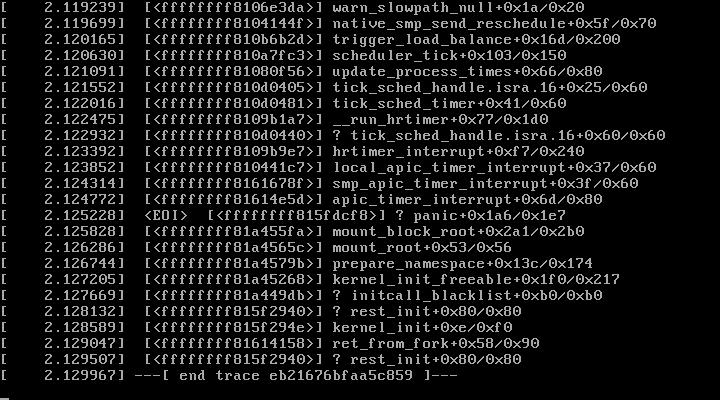

# Misc Errors/Problems

### Re-sizing root partition, removing /var/nova/instances
In order to get the full disk on the root partition, follow the steps below:

All mounting and remove - resize operations must be done as root

You should see two partitions, a vg_moc-root and vg_moc-lv_instances
```$ lvdisplay```

Make sure there is no data stored in /var/nova/instances **BEFORE** you unmount it
```$ umount /dev/mapper/vg_moc-lv_instances```

This next step deletes the old lv, so only do this if there is no data left in the partition
```$ lvremove /dev/mapper/vg_moc-lv_instances```

Next, resize the remaining partition and grow the filesystem to match the new space
```
$ lvresize -l +100%FREE /dev/mapper/vg_moc-lv_root
$ xfs_growfs /dev/mapper/vg_moc-lv_root
```

Check that the change worked, and we only have one large root partition
```$ lvdisplay```

### Node 39 crashes
(Hua/Abesari)



Possible solution (Yue) We will rebuild this node with RHEL7.1.
1. Rebuild the Nodes from the Foremen. https://192.168.122.162/users/login (admin/welcome1)
2. Go to the 39 host and click build on the top . https://192.168.122.162/hosts/compute-39.moc.ne.edu
3. Go to the Haas Master and log in to https://10.99.1.139/ to install the RHEL (User/Password: admin/73qtx8nVXa4c06)
4. Launch KVM console (you need to install icedtea and jdk before that)
5. Warm boot
6. LSCI / Disable EFI change the boot sequence to 8200 or 600 at the first and 400 at the second.
7. Clear the configurations from RAID
* Configuration -> Clear Configuration -> Yes
 
### Ceph-Iscsi Issue
This turned out to be conflicting IP addresses.  Compute nodes were programmatically being assigned IPs on the Ceph network based on their number, e.g. compute-20 was at 192.168.28.20.

However, 192.168.28.{11-14} were already taken by the four storage nodes of the Fujitsu appliance, so computes 11, 12, 13, and 14 caused conflict.

A useful trick from Peter: In case of IP conflicts, you need to run `arp -d <ipaddress>` on the relevant nodes before testing fixes, otherwise the arp cache contents might make it look as if your fix has not worked.

