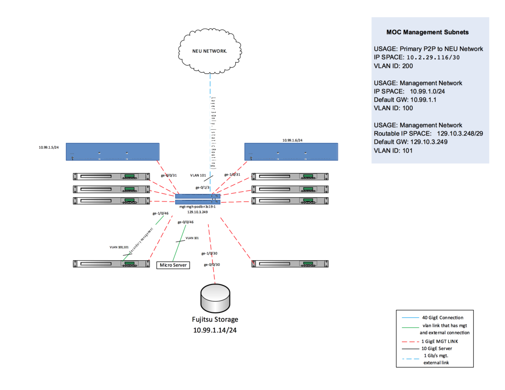
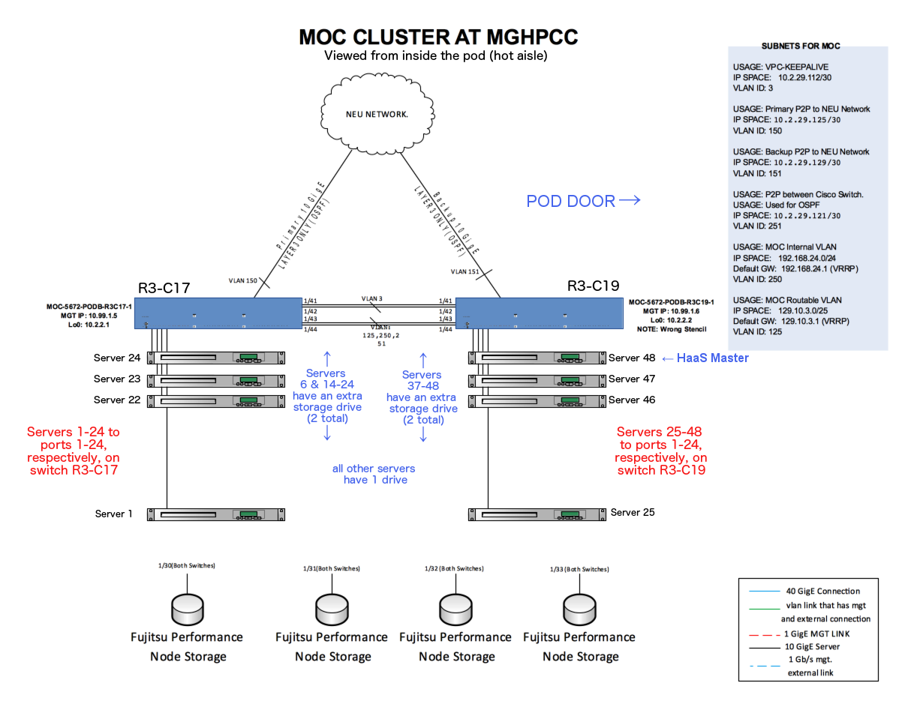

# Northeastern Cluster
Instructions for [Accessing Northeastern Cluster](Accessing-Northeastern-Cluster.html)

### Projects
* [Kaizen Production](Kaizen-Production.html)
* [Monitoring in NEU Env.](Monitoring-in-NEU-Env..html)
* [Staging Area](Staging-Area.html)
* [VMs running on physical nodes](VMs-running-on-nodes.html)

### Equipment
[NEU Equipment Sign-Out](NEU-Equipment-Sign-Out.html)

  **SERVERS**
  * Cisco UCS C220 M3 SSF (x48). See [this file]<!--(CiscoConfiguration.pdf)--> for list of configuration components. 
  * numbers 1-24 in rack 17, 25-48 in rack 19.  Numbered from bottom of rack up.
  * More information specific to the [Cisco UCS C220](Cisco-UCS-C220.html) nodes
  * Internal Storage
    * All nodes have a single 300GB drive in slot 1
    * These nodes also have an additional 1TB drive in slot 2: 
      * node 6, nodes 14-24, nodes 39-47
    * Node 48 (the haas master) has 3 additional 1TB drives 
  * IPMI access [VM Setup for Cisco IPMI Access](VM-Setup-for-Cisco-IPMI-Access.html)
  * There is also a SuperMicro emergency box
    * default IPMI credentials: see bitwarden Default SuperMicro Credentials 

  **SWITCHES**
  * Cisco Nexus 5672 (x2)
  * More information at [Cisco Switches (NEU cluster)](Cisco-Switches-\(NEU-cluster\).html)
  * Servers are connected to the switch ports in order 
    * on switch R3-C17, server 1 connects to port 1, server 2 to port 2, and so on up to server 24 to port 24.
    * on switch R3-C19, server 25 connects to port 1, server 48 to port 24.

  **STORAGE**
[Fujitsu CD10000](Fujitsu-CD10000.html)

  **Networks**
[Northeastern Cluster Network Documentation](Northeastern-Cluster-Network-Documentation.html)

### Setup/Configuration
* [Kilo/RHEL-OSP-7 Deployment](Kilo-RHEL-OSP-7-Deployment.html)
* [Icehouse/Red Hat 7.0 Deployment Experimentation](Icehouse-Red-Hat-7.0-Deployment-Experimentation.html)
* [Installing CentOS 7 on a node hard drive](Installing-CentOS-7-on-a-node-hard-drive.html)

### Miscellaneous
[Misc. errors/problems](Misc.-errors-problems.html)

### Updates:

**(5 Aug. 2016)**

The top connections between R3-C17 and R3-C19 switches (VLAN3) are not being used (configured) right now. Thus, it would be possible to reclaim two ports from each of the two switches.   

