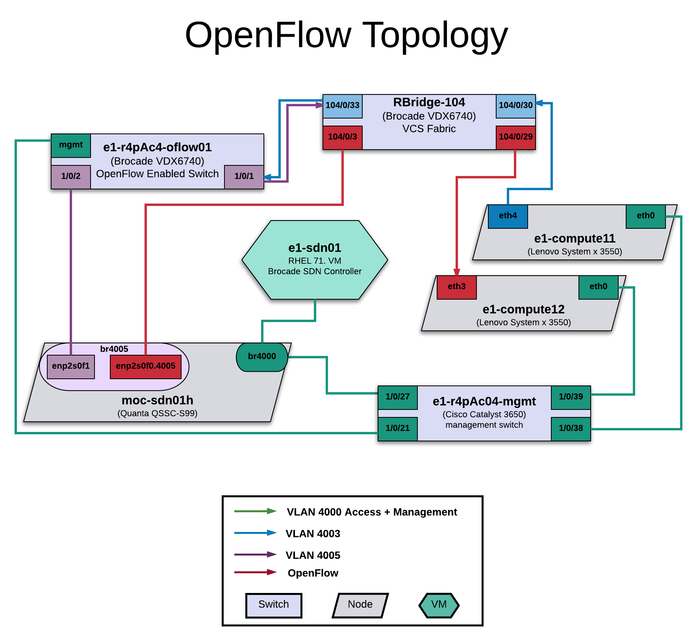

### Topology Diagram

### Overview

The SDN controller listens on port 6633.  OpenFlow enabled devices configured to know about the controller advertise their existence to it.  Control signals pass back and forth over this network. In our setup, this network exists on VLAN 4000 and is connected via the 1G management switch.  The physical host moc-sdn01h provides the network to its VMs via br4000.

The Brocade VDX only advertises from its RJ45 management port, not the 10G ports.

On the OpenFlow VDX switch port 1 is connected to the Brocade Fabric via port 33 on Rbridge-104.  Port 33 is administratively disabled on Rbridge-104 for the moment.  Port 2 is connected to the physical host moc-sdn01h.  Nothing of importance is configured; there may be remnants of a 10.12.0.0/24 network configured but it is OK to remove these.

### Network

     10.1.10.1  e1-services
     10.1.10.2  -- *reserved for moc-sdn01h but not currently in use* --
     10.1.10.3  e1-sdn01 (VM on moc-sdn01h)
     10.1.10.4  mininet (Laura's testing VM on moc-sdn01h)
     10.1.10.5  mininet-dhcp (VM on moc-sdn01h running Ubuntu Server 16.04)
     ...
     10.1.10.16 e1-r4pAc04-oflow01  (Brocade VDX6740)
           Credentials: admin/openflow

Users without accounts on e1-services can still get into e1-sdn01 like this:

     # ssh <username>@128.52.62.147 -p 2222
     
e1-sdn01 also has access to the Brocade Fabric management at 10.10.10.64

### Configuration of the Brocade VDX6740

     e1-r4pAc04-oflow01# config
     Entering configuration mode terminal
     e1-r4pAc04-oflow01(config)# openflow-controller e1-sdn01   
     e1-r4pAc04-oflow01(config-openflow-controller-moc-sdn)# ip address 10.1.10.3 method no-ssl port 6633
     e1-r4pAc04-oflow01(config-openflow-controller-moc-sdn)# exit
     e1-r4pAc04-oflow01(config)# rbridge-id 1
     e1-r4pAc04-oflow01(config-rbridge-id-1)# openflow logical-instance 1
     e1-r4pAc04-oflow01(config-logical-instance-1)# controller e1-sdn01
     e1-r4pAc04-oflow01(config-logical-instance-1)# activate

To set a port as an openflow port:

     e1-r4pAc04-oflow01# config
     Entering configuration mode terminal
     e1-r4pAc04-oflow01(config)# int ten 1/0/1
     e1-r4pAc04-oflow01(conf-if-te-1/0/1)# openflow logical-instance 1
     e1-r4pAc04-oflow01(conf-if-te-1/0/1)# openflow enable
     e1-r4pAc04-oflow01(conf-if-te-1/0/1)# end

If you need to change the controller config, you will have to run `no openflow logical instance 1` on the relevant ports, and `no activate` on the logical instance.  Then make your changes to the controller, re-activate the logical instance, and add it to the ports again.  

### Brocade SDN controller

Brocade SDN Controller v.3.2.1 is running on the virtual machine e1-sdn01.  It is installed in the directory /opt/brocade.  This consists of two parts, the sdn controller (brcd-bsc) and the UI (brcd-ui).

Both parts can be started/stopped using this syntax:  `service brcd-bsc start`

The web GUI is reached at: `http://10.1.10.3:9001` from the controller VM or from moc-services.

To test if the controller is running properly, you can also navigate to `http://10.1.10.3:8181/restconf/modules`.  You should see the RESTconf module definitions - if you get an error or the page does not load, try restarting the controller.

Credentials for the controller GUI are admin/admin.

### Mininet DHCP interception script

Mininet is an application that creates a virtual openflow topology. [Mininet home page](http://mininet.org/)

Gary Berger from Brocade wrote a script that is a proof of concept of a virtual DHCP-interception environment.  Gary's explanation of how it works:

     I created a Mininet test script to demonstrate the use-case of intercepting a DHCP message.
     
     Overview
    
     There are two hosts:
          C1  = the client. This host is configured with address 0.0.0.0/0 and executes dhclient to obtain an IP
          S1 = Server. This is running dnsmasq in dhcp only mode with a pool of IP to allocate
          X1 = Switch – Representation of an OF switch
    
     The controller is BSC 3.2.1.

     Client is initialized and sends out a UDP message. There is a flow in the ovs-table that forwards all UDP   
     packets to ports 1,2 and controller. Because the UDP message is flooded the server responds and sends back 
     a DHCP Offer.
     
     One can write an application in ODL that looks specifically for DHCP/BOOTP messages and analyzes.

     Installation

     Clone the repo into your mininet VM/host https://gitlab.com/firstclassfunc/openflow-testing.git
   
     If you don’t have virtualenv, if you don’t have PIP do $> sudo apt-get install python-pip or equiv

          $> pip install virtualenv

     Create virtualenv environment
     
          $> virtualenv /tmp/working

     Load virtualenv environment

          $> source /tmp/working/bin/activate

     Load dependencies 

          $> python setup.py develop

     Run the script

          $> python moc.py –controller=<ip-of-controller> --port=<if-not-6653>

     I am basically sending all UDP packets to every port with this command:
 
           x1.dpctl('add-flow',  'dl_type=0x0800,nw_proto=17,actions=output:1,2,3,controller')

     You can of course limit this down to BOOTP messages, you have to at least flood this as a broadcast
     so the server can see it. You can also program this flow from the controller instead of from the script 
     using the RESTConf interface.

     You can see the DHCP Request below using tshark running on the controller.

You can use the mininet-dhcp virtual machine to test this.  The usual suspects have public key root access.

If you get an error like this:   

     *** x1 : ('ovs-ofctl', 'add-flow', <OVSSwitch x1: lo:127.0.0.1,x1-eth1:None,x1-eth2:None pid=8703> , 'dl_type=0x0800,nw_proto=17,actions=output:1,2,3,controller')
     2016-07-22T14:00:48Z|00001|vconn|WARN|unix:/var/run/openvswitch/x1.mgmt: version negotiation failed (we support version 0x01, peer supports version 0x04)
     ovs-ofctl: x1: failed to connect to socket (Broken pipe)

Then open the script moc.py and change this line:
     
     x1 = self.addSwitch('x1', cls=OVSKernelSwitch, protocols='OpenFlow13')
     
to this:

     x1 = self.addSwitch('x1', cls=OVSKernelSwitch, protocols='OpenFlow10')

Also, if you get an error that mininet.net is not found, try running both the setup.py and the moc.py with sudo privileges and it should work.

     
