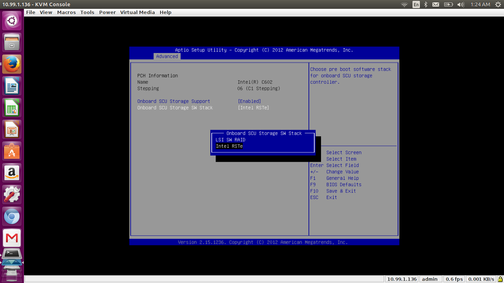
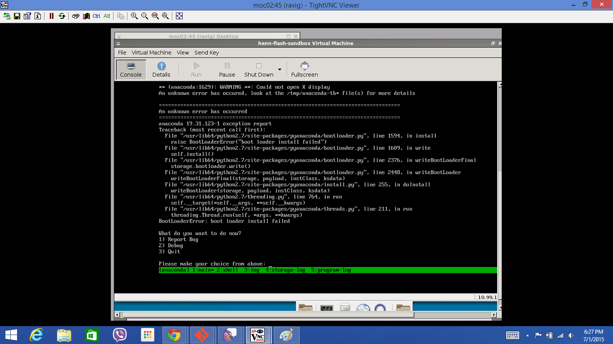
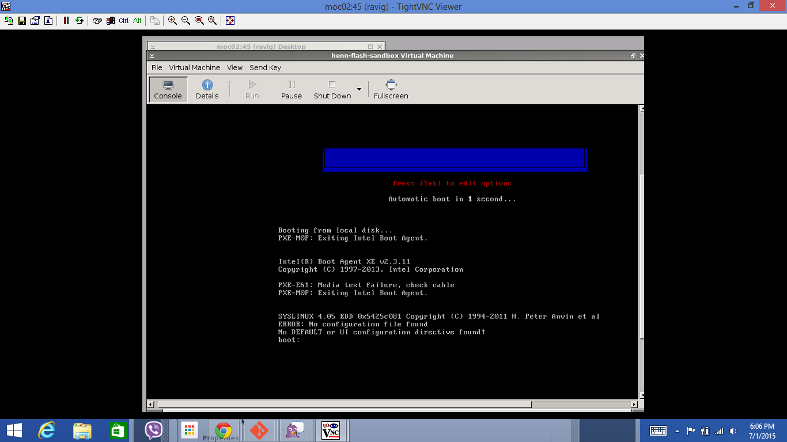

# RHEL OSP 7 Iso Installation
["released" version of OSP](https://access.redhat.com/documentation/en/red-hat-enterprise-linux-openstack-platform/version-7/release-notes)

For few of the nodes, partition tables given by Brent didn't work. So, we had to old partition tables that worked. - Ravi

### Partition tables that worked
```
 zerombr
 clearpart --all --initlabel
 part /boot --fstype ext3 --size 128
 part / --fstype ext3 --size 4096 --grow --maxsize 8192
 part /var --fstype ext3 --size 4096 --grow --maxsize 8192
 part swap --recommended
```

### Nodes where it partition tables didn't work
1,3,7,21 and 22 

## Clear old partitions through anaconda boot prompt during RHEL 7.1 install
* Drop into the shell with macros -> static macros -> alt-F's -> alt-f2
* run `"fdisk /dev/sda"`
* when in fdisk, type d for all of the partitions
* next, press w to right the config back
* if `/dev/sdb` exists, repeat the last three steps for /dev/sdb as well

[RHEL-OSP-7 Beta code](ftp://partners.redhat.com/b5d52ebbb756856c8e7e6f44880b4741/OpenStack/)  (updated 7/24/2015)

******
### Thursday 07/09/2015
We had a long discussion with Brent from RedHat and finally he gave a suggestion of dropping RAID controller altogether use the underlying disks as usual. He wasn't sure if the old configuration for partition tables which we had working would be supported by RedHat. So, he wanted us to use the following partition tables:
```
clearpart  --all --initlabel 
zerombr
 
        Disk partitioning information
part /boot --fstype ext3 --size=384 --ondisk=sda --asprimary
part swap --size=16384 --ondisk=sda
part pv.01 --size=1 --grow --ondisk=sda
volgroup vg_moc pv.01
logvol  /  --vgname=vg_moc --size=131072 --fstype=xfs --name=lv_root
logvol  /var/nova/instances --vgname=vg_moc --size=1 --fstype=xfs --grow  --name=lv_instances
```

I tested them on node with single disk and it worked fine. So, our primary goal is to ensure all the nodes have the configuration which Brent suggested. 

### Next Steps
Had a discussion with Piyanai and it seems that we need to focus on 25-48 nodes for now. Out of which following nodes are already being used as per Equipment-Sing-out page:
* 10.99.1.{129,142,146} - Some problem when trying to release from a project - have to talk to Ian/George.
* 10.99.1.{128,147} - Jon (Kilo Deployment)
* 10.99.1.{126,127,144,145} - James Cadden (HaaS - Apoorve/Sahil are supporting him)
* 10.99.1.148 - HaaS Master
* 10.99.1.133 - Ian Testing
* 10.99.{125,130,131,132,134,135,136,137,138,139,140,141,143} - Nodes have 7.1 installed as suggested by Brent(RedHat).

Out of 24 nodes we have, we cannot touch the above ones as they are already done or being used currently. This leaves us with 12 Nodes. 

### Steps to be done
Press F2 which will take us to boot options screen.

We need to change parameters at 3 locations. Please follow the screenshots below.





******
### Tuesday 7/7/2015(Ravi):

  **Successful Scenario**
The issue seems to be with partition tables that are part of Kickstart template or it may be of not relevance to us as we are using a different RAID configuration. This has auto-partition in place. We modified it so that we can So, we changed the partition tables and no where mentioned the disk on which we are installing OS. Following is the partition table that worked.
```
> zerombr
> clearpart --all --initlabel
> part /boot --fstype ext3 --size 128
> part / --fstype ext3 --size 4096 --grow --maxsize 8192
> part /var --fstype ext3 --size 4096 --grow --maxsize 8192
> part swap --recommended
```

Also, notice the ext3 which we used. Previously, we used to have xfs which is default for Centos6.5 and above.

  **Tests failed**
The below are the partition tables for standard template which we get from foreman. These were not working because of which we tried manual partitioning in first place.
```
>zerombr
>clearpart --all --initlabel
>autopart
```
We tried the manual partitioning options as well, which failed. Always we were getting 2041.16 MB less before the partitioning starts.
```
>clearpart --all --drives=sda,sdb
>part swap --recommended --fstype=ext4 --ondisk=sda --asprimary
>part /  --size=604800 --fstype=ext4 --grow --ondisk=sdb
>part /boot --fstype=ext4 --size=204800 --ondisk=sdb --asprimary
>part /usr --fstype=ext4 --asprimary --size=12288    
>part swap --size=8192
>part /var --fstype=xfs --size=6144
>part /tmp --fstype=ext4 --size=2048
``` 

Also, notice the difference when it worked we didnot mention any drive on which this has to go. From the Northeastern cluster diagram, we can see that few nodes donot have explicit sdb because of this partitions would have failed. 

I tried them on nodes where it has 2 disks and changed it to sda which has single disk but it failed. When I tried with ext4 I got blank screen couple of times. (Also, not sure if the RAID configuration is culprit altogether here.)

******
### Wednesday
We were able to boot syslinux today. The trick is to type in all the entries in the extlinux.cfg located at /boot/extlinux manually and then it would proceed with booting.

Following is the sample for node46:
```
boot: /vmlinuz-3.10.0-229.el7.x86_64 initrd=/initramfs-3.10.0-229.el7.x86_64.img rd.lvm.lv=rhel_mocrhel-46/root rd.dm.uuid= ddf1_4c5349202020202080861d60000000004711471100001450 root=/dev/mapper/rhel_mocrhel--46-root nofb crashkernel=auto rd.lvm.lv=rhel_mocrhel-46/swap splash=quiet rhgb quiet LANG=en_US.UTF-8
```

We tried with GRUB as well again and it failed with following message:



Syslinux failure image:



******
### Tuesday, June 30, 2015 12:39 AM

**Issue**: OS gets installed sometimes and fails sometimes during pxebooting.

** Observations & Troubleshooting done**

Tokens are given by foreman for tftp server which expire for every 60 min. Thought this could be issue and disabled it as kickstartfile will no longer be in http serverafter that specific timeout - No luck.

Created a manual Kickstart.cfg from existing one and kept it in apache and updated the template file to point to this - Failed :(

At first, I thought that it could be network issue as the logs on /var/log/messages are getting updated with IPv6 records whenever it fails. So updated /etc/sysconfig/named file and errors are not seen in the logs. But still issue persists.

Thought system is not able to communicate with pxeserver as both of them have a difference of few hours between them. Tried modifying the template file with appropriate timezones- No luck

With Peter's help, we were checking on logs on server during the installation phase and it hangs with errors related to kernel. - We may need to dig deeper.

I think, we can narrow down on system as network and foreman may not be causing issues as per experiments done by us. Please let me know your thoughts on the above analysis done and next steps.

******
### Monday, June 29, 2015 10:51 AM

  **Ravi wrote** :
I was analyzing /var/log/messages for the system and when the installer is hanging, I found an error, related to named
```
Jun 27 05:45:37 foreman named[12349]: error (network unreachable) resolv
ing 'mirrors.fedoraproject.org/A/IN': 2001:4178:2:1269:dead:beef:cafe:fe
d5#53
Jun 27 05:45:37 foreman named[12349]: error (network unreachable) resolv
ing 'mirrors.fedoraproject.org/AAAA/IN': 2001:4178:2:1269:dead:beef:cafe
:fed5#53
Jun 27 05:46:03 foreman named[12349]: error (network unreachable) resolv
ing '2.rhel.pool.ntp.org/A/IN': 2a02:2290:2:48::73#53
Jun 27 05:46:03 foreman named[12349]: error (network unreachable) resolv
ing '2.rhel.pool.ntp.org/AAAA/IN': 2a02:2290:2:48::73#53
```

I was doing a bit more research and found we are using chrony for ntp and the /etc/chrony.conf on foreman system is pointing to centos ntp mirrors. So, I am wondering, if lack of internet connectivity on our server is causing this issue.

Also, this is happening intermittently on our system. I tried checking on node 47 where installation happening fine. It seems chrony rpm is not installed altogether but its there as part of rpm packages for rhel iso.

```
[root@node-47 ~]# systemctl status chronyd
chronyd.service
   Loaded: not-found (Reason: No such file or directory)
   Active: inactive (dead)

[root@node-47 ~]# chronyd status
-bash: chronyd: command not found
```

2 options which may work:
* Removing chrony package from list of rpms and creating an iso again.
* Providing internet connection to server, so that they can continue installation.
 
******
### Friday, June 26, 2015 12:11 AM
Foreman was able to identify the baremetal and pxebooted the baremetal so that it could be seen in the foreman. We are trying to pxeboot CentOS which failed because it was not able to connect to internet.

Tried creating a bridge for private network and publicly exposed VLAN(Internet facing) which didn't work.

As a workaround tried using foreman apache as http server and for 7.0 it has kickstarted anaconda installer and failed without providing logs. I am currently working onprovisioning 6.5 iso which I downloaded from Centos vault archives.

