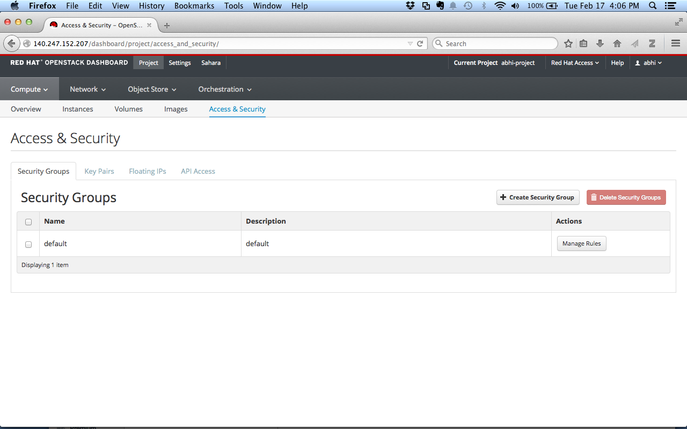
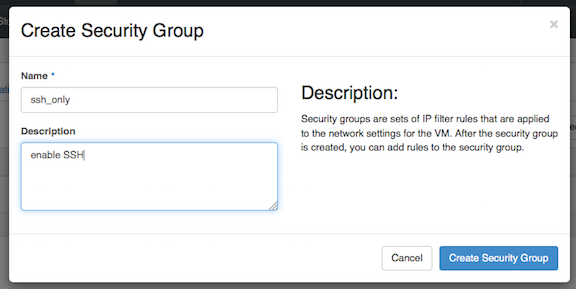
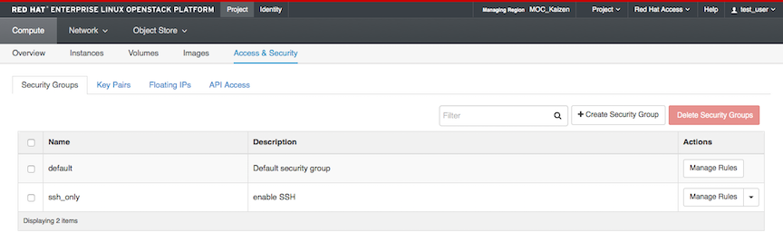
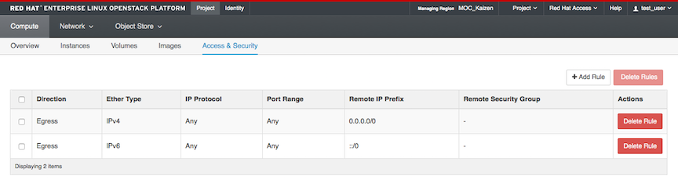
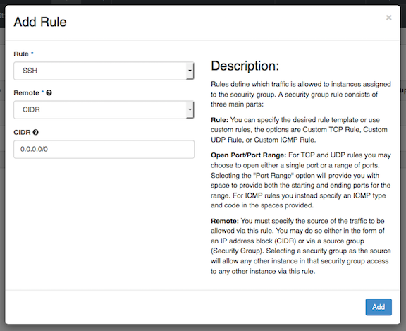
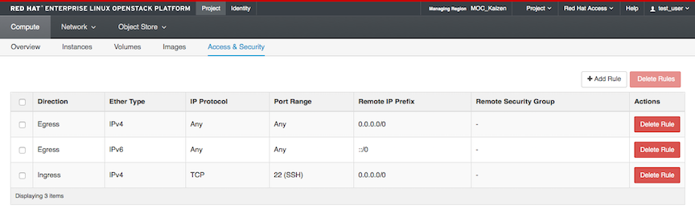
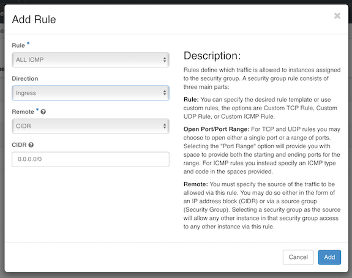

# Security Groups 
Before you launch a VM, you must configure some security settings so that you will be able to log in via ssh.

Navigate to Project -> Compute -> Access and Security

Click on the Security Groups tab.  

You should see a ‘default’ security group.  

Security groups are profiles that control the firewall settings which allow or block access to instances that are members of the group.  
 
The default security group allows traffic only between members of the security group, so by default you can always connect between VMs in this group.

However, it blocks all traffic from outside, including incoming SSH connections.  In order to access instances via a public IP, an additional security group is needed.

Security groups are very highly configurable, so you can create different security groups for different types of VMs used in your project.

For example, for a VM that hosts a web page, you need a security group which allows access to ports 80 and 443.

You can also limit access based on where the traffic originates, using either IP addresses or security groups to define the allowed sources.

### Create a new Security Group
Click on "Create Security Group."  Give your new group a name, and a brief description.

In the example, we will enable SSH from anywhere so we can access the VM via a public IP.

Your new group now appears in the list.  Click the "Manage Rules" button in the "Actions" column next to your new security group.

You will see some existing rules:

Let's create the new rule to allow SSH. Click on Add Rule.

You will see there are a lot of options you can configure on this screen.

There is a built-in SSH option to make things simple.  Choose 'SSH' from the 'Rule' drop down menu and click "Add."  

The new rule now appears in the list.

**Allowing Ping**

The default configuration blocks ping responses, so you will need to add an additional group and/or rule if you want your public IPs to respond to ping requests. 

Ping is ICMP traffic, so the easiest way to allow it is to add a new rule and choose "ALL ICMP" from the dropdown.

More on different types of ICMP codes can be found at [this link](http://www.nthelp.com/icmp.html).

*Note that due to a [known bug](https://bugs.launchpad.net/horizon/+bug/1511748) setting a specific ICMP type may give an error message.*

Make sure to add VMs with public IPs you want to ping to the security group containing this rule.

******
 
Next: [Create a Key Pair](Create-a-Key-Pair.html)  

Previous:  [Create a Router](Create-a-Router.html)  

[Openstack Tutorial Index](OpenStack-Tutorial-Index.html)

