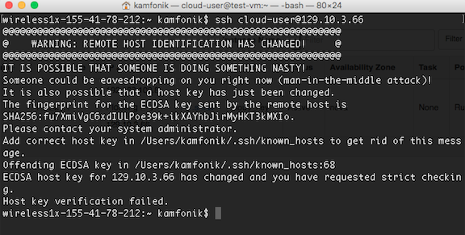
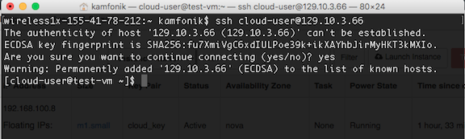

# Troubleshooting SSH Login
*This page is deprecated. Please visit [this page](https://massopen.cloud/blog/wiki/kaizenfaqs/) instead.*

So you're pretty sure you have set everything up correctly, but you keep getting an error message or a timeout when you try to log in via ssh.  

Here are some solutions to common issues our users have:     
* "Permission Denied" error
   * [Are you using the right user name?](#user)
   * [your key is not on the remote host](#absentkey)
   * [file permissions are not correct on the remote host](#permissions)
   * [ssh-agent is not running, or your key is not added to it](#sshagent)

* SSH times out
   * [ssh is not enabled on the VM security group] (#sshenable)
   * [the VM is not booted] (#notbooted)

* Other errors
   * [REMOTE HOST IDENTIFICATION HAS CHANGED / Host key verification failed](#hostfail)

******

### "Permission Denied" errors

Are you using the right user name?

The default usernames on each base image correspond to the operating system:
* centos base images have the user 'centos'
* ubuntu base images have the user 'ubuntu'
* red hat base images have the user 'cloud-user'

If you fail to specify the user in the ssh command, it will try to log you in using whatever username you are logged in as on your local machine.  Specify the user:

      $ ssh -A ubuntu@your_vm's_IP
or
      $ ssh -A -l ubuntu your_vm's_IP

### Key not on remote host

Did you just launch a VM, without selecting your key in the 'Access and Security' tab?

Unless you used a teammate's key and they can help you out, you will have to terminate that VM and start again, making sure to add your key this time.  

If a VM was spawned using your teammate's key, you can have them add your public key to `.ssh/authorized_keys` on the VM before you will be able to log in.

Give them a file containing your public key (this is 'cloud_key.pub' in the example) and have them perform the following steps:

     $ scp cloud_key.pub user@your_vm's_IP
     $ ssh user@your_vm's_IP
     $ cat cloud_key.pub >> ~/.ssh/authorized_keys

(Make sure to use `>>` and not `>` or else you will overwrite the other key instead of just appending yours).

### SSH File Permissions
OpenStack sets the permissions automatically when it launches a new VM, so if you are trying to log into a newly spawned VM, this isn't the problem.

However, if people have been editing `.ssh/authorized keys`, they might have accidentally changed something.

You need to make sure that the permissions on .ssh are 700, which looks like `drwx------`:
     
     [user@myvm ~]$ ls -al | grep .ssh   
     drwx------   16 user  user        544 Feb 12 11:38 .ssh

and .ssh/authorized keys should be 600, which looks like `-rw-------`

     [user@myvm ~]$ ls -al .ssh/
     -rw------- 1 user user 2.2K Feb  9 15:13 authorized_keys

Also make sure the owner of the file is the user you are trying to log in as, not root or some other user.

If you have root access to the VM, for example via the web console login, you can fix the file permissions using the `chmod` and `chown` commands:

     # chmod 700 /home/<username>/.ssh
     # chmod 600 /home/<username>/.ssh/authorized_keys
     # chown <username>:<groupname> /home/<username>/.ssh/
     # chown <username>:<groupname> /home/<username>/.ssh/authorized_keys

### Troubleshooting ssh-agent
If you have trouble with adding the key to your agent and forwarding it, it may be that ssh-agent is not running, or your key is not added correctly.

Check if it is running:

      $ ps -aux | grep ssh-agent

If its running already, the output will look something like this: 

      501   943     1   0  9:34PM ??         0:01.26 /usr/bin/ssh-agent -l

### Starting ssh-agent
If ssh-agent is not running, you can start it like this:

      $ ssh-agent > agent_variables.tmp
      $ source agent_variables.tmp      #You will see an output from this step like "Agent pid <some number>"
      $ rm agent_variables.tmp

What you are doing these steps is starting the agent and importing some necessary environmental variables to use with it.

If you had just typed 'ssh-agent' without directing the output to a file, you would see something like this:

      SSH_AUTH_SOCK=/tmp/ssh-N2O3IxWPoczq/agent.4328; export SSH_AUTH_SOCK;
      SSH_AGENT_PID=4329; export SSH_AGENT_PID;
      echo Agent pid 4329;

`SSH_AUTH_SOCK` and `SSH_AGENT_PID` are the variables you need to add to your environment to use the agent.

You could copy and past these two lines to the command line to do that.

### Adding your key
After starting ssh-agent, you will need to add your key:

     $ ssh-add ~/.ssh/<private_key_filename>

If your key has a default name like id_rsa, it is usually added automatically when the agent starts, but if you gave it a different name you will have to add it again every time the agent restarts.

You can always check if your key is added like this:

     $ ssh-add -l
     4096 SHA256:CBC6QYABDmr8vG5EQE+n7vvPIM5USVv1iTWgM9/ZMJ4 .ssh/cloud_key (RSA)

Above, we see that cloud_key is added.

### Checking your agent forwarding
If after connecting to the first VM, you find that your key doesn't seem to be logging you into another VM from there, you can check that your agent is forwarded by typing:

      $ echo SSH_AUTH_SOCK

from the first VM.  The output should look like:

      /tmp/ssh-N2O3IxWPoczq/agent.4328

If it is blank, it means your key is not forwarded.  Did forget to type -A?

If the agent is forwarded, but your key still doesn't work, use the instructions above to check that the correct key is added to the agent.

### SSH times out did you open the SSH port on the VM?
Did you create a security group with SSH enabled?  Did you remember to select this security group when you launched this VM?

You can check the rules applied to a specific VM by going to Compute-->Instances and clicking the instance name.

Scroll down to Security Groups and check for your SSH security group, and check that this line appears:

     ALLOW IPv4 22/tcp from 0.0.0.0/0

Instructions on creating a security group are here: [[Security Groups]]

You can add a security group to your VM after launch.  Go to Project-->Compute-->Instances and click the dropdown menu under the 'Actions' column next to your VM.

Choose 'Edit Security Groups'.  In the popup that appears, find the security group in the list on the left and click the `+` button next to it.

This will move it to the list on the right.  Once you have the right group(s) added, click Save.

### VM may not be booted
Go to Compute-->Instances and check that your VM is in the Running state. If it is not, boot it and try again.

If it is running, but SSH still times out, click the dropdown next to the instance and choose Console.  Click the link to show only the console.

You will get an error screen, but refresh the page and you should see a console screen.  

Is the login prompt showing? Are there any error messages on the console screen?  Try rebooting your VM and see if that fixes the problem.

If the VM is not booting properly, you need to fix that problem first before SSH will work.

One common reason VMs do not boot is if you chose a flavor that is too small for the OS image you chose - the CentOS, Ubuntu, and RHEL images should use m1.small or larger.

### Host Verification Fails

Your project may use the same floating IP for different VMs.  It is possible that moving the IP from one VM to another will cause you to get the following error message:

This happens because your computer records an identification key each time it connects to a new host.  Remember this prompt?

Your computer recorded a key from the first VM and associated it with the IP address.  Since it received a different key this time, it refuses to connect.

If this happened unexpectedly, we might be worried that our VM was compromised in some way.

But in this case, we know we just changed which VM the IP address is pointing to, so it's OK.  We just need to remove the old host key.

Open the file `~/.ssh/known_hosts` in your favorite text editor.  Find the line starting with the IP address of your VM.  It should look something like this:

      129.10.3.66 ecdsa-sha2-nistp256 AAAAE2VjZHNhLXNoYTItbmlzdHAyNTYAAAAIbmlzdHAy NTYAAABBBNAdpmhHLWgwwiUf8nU4xr9G1HUvbsWMoVpyUMgcg64Foh5hUCYTX6VvxZdPO2S+fGZ2abtoz1LCkeEy3mAck0k=

Just delete the entire line.  Try the ssh connection again.  You should get the `are you sure you want to connect` prompt.  Your computer will record the new host key.

