# Volumes 
A **Volume** is a removable disk that can be mounted to an instance.

You can think of it as a USB drive.

You can move volumes between different instances, or boot new instances from bootable volumes, but a volume can only be mounted to one instance at a time.

Ownership of volumes can be transferred to another project.

Some uses for volumes:
* Persistent data storage for ephemeral instances.
* Transfer of data between projects
* Bootable image where disk changes persist 
* Mounting the disk of one instance to another for troubleshooting
    
To get started, navigate to Compute -> Volumes.

### Empty Volumes

**Create an empty volume**

An empty volume is like an unformatted USB stick.  We'll attach it to an instance, create a filesystem on it, and mount it to the instance.

Click "Create Volume". In the resulting popup, give your volume a name.  The description field is optional. 

Choose "empty volume" from the Source dropdown.  This will create a volume that is like an unformatted hard disk.  Choose a size for your volume.

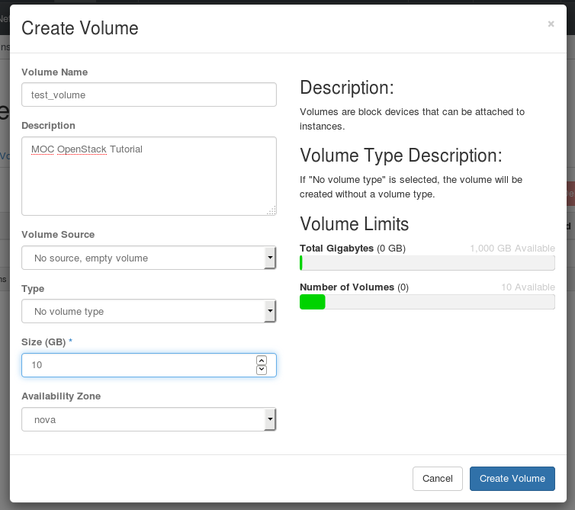

Click Create.  In a few moments, the volume will appear in the Volume list with the status Available.

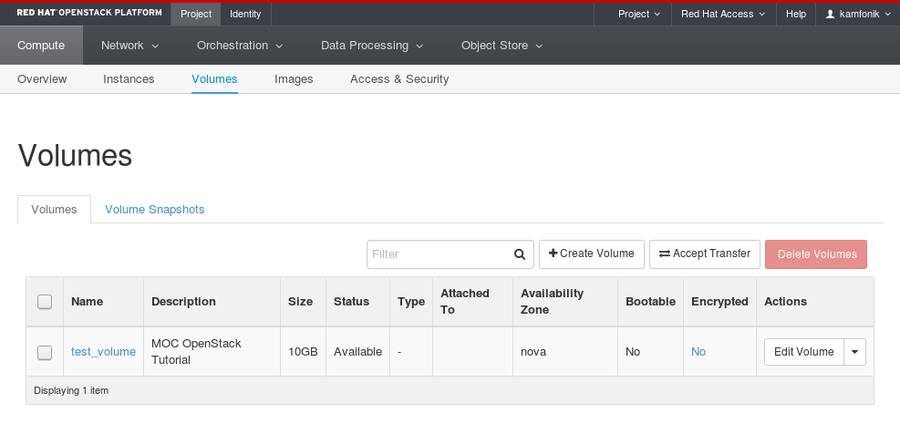

**Attach the volume to an instance**

In the Actions column, click the dropdown and select Manage Attachments.  

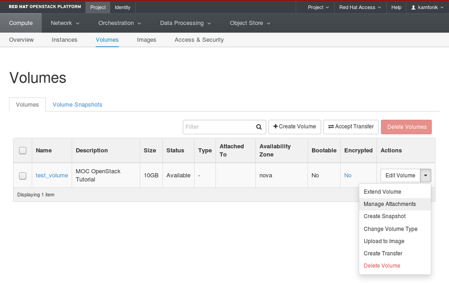

From the  menu, choose the instance you want to connect the volume to, and click Attach Volume.

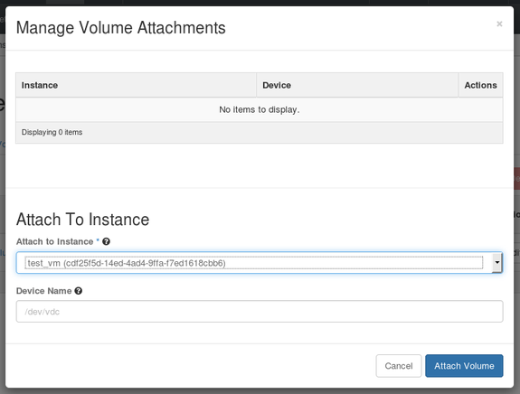

The volume now has a status of "In Use" and the Attached To column notes which instance it is attached to, and what device name it has.

This will be something like `/dev/vdb` but it can vary depending on the state of your instance, and whether you have attached volumes before.

Make note of the device name of your volume.

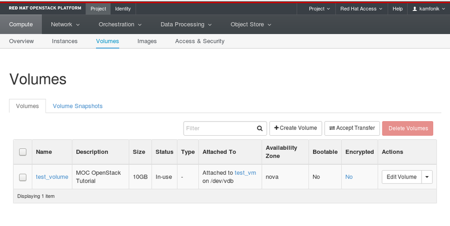

**Format and mount the volume**

SSH to your instance.  You should now see the volume as an additional disk in the output of `sudo fdisk -l` or `lsblk`.

    # lsblk
    NAME   MAJ:MIN RM SIZE RO TYPE MOUNTPOINT
    vda    253:0    0  20G  0 disk 
    └─vda1 253:1    0  20G  0 part /
    vdb    253:16   0  10G  0 disk 
 
We see the volume here as the disk 'vdb', which matches the `/dev/vdb/` we noted in the Attached To column.

In this case it's easy to spot because there is only one additional disk attached to the instance, but it's important to keep track of the device name, especially if you have multiple volumes attached.

Also, a given volume might not get the same device name the second time you attach it to an instance.

Create a filesystem on the volume and mount it - in the example we create an ext4 filesystem:

    # mkfs.ext4 /dev/vdb
    # mkdir /mnt/test_volume
    # mount /dev/vdb /mnt/test_volume 
    
The volume is now available at the mount point:

    # lsblk
    NAME   MAJ:MIN RM SIZE RO TYPE MOUNTPOINT
    vda    253:0    0  20G  0 disk 
    └─vda1 253:1    0  20G  0 part /
    vdb    253:16   0  10G  0 disk /mnt/test_volume
 
If you place data in the directory /mnt/test_volume, detach the volume, and mount it to another instance, the second instance will have access to the data.

**Detach a volume**

To detach a mounted volume by going back to Manage Attachments and choosing Detach Volume.

Once it is successfully detached, you can use Manage Attachments to attach it to another instance if desired.

### Create Volume from Image

You can create a volume from an existing image.  If the image is bootable, you can use the volume to launch an instance.

Click Create Volume.  This time, for Volume Source, choose 'Image'.  From the 'Use Image as Source' dropdown, choose the image you'd like to use.

To use this volume to launch an instance, you can choose Boot From Volume in the Instance Boot Source dropdown when creating an image, then select your volume from the Volumes list.

Make sure 'Delete on Terminate' is unchecked if you want the volume to persist after the instance is terminated.
 
Note that only one instance at a time can be booted from a given volume.

### Transfer a Volume

You may wish to transfer a volume to a different project.

Perhaps you did some work in your individual project, and you want to transfer a volume containing the work to your team's project.  

The volume to transfer must not be attached to an instance.  Click the dropdown next to the volume and choose Create Transfer.

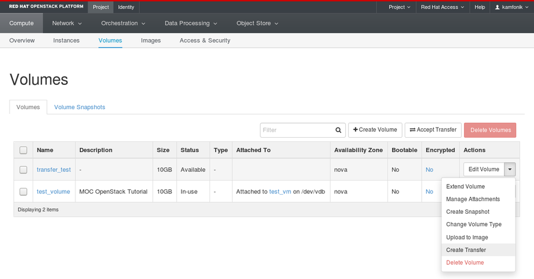

Give the transfer a name.

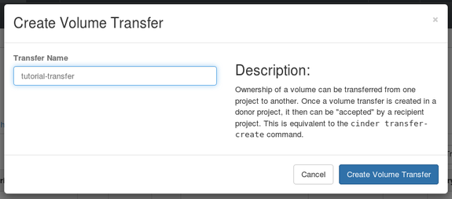

You will see a screen like this.  Be sure to capture the Transfer ID and the Key.

You can always get the transfer ID later if needed, but there is no way to retrieve the key.

If the key is lost before the transfer is completed, you will have to cancel the pending transfer and create a new one.

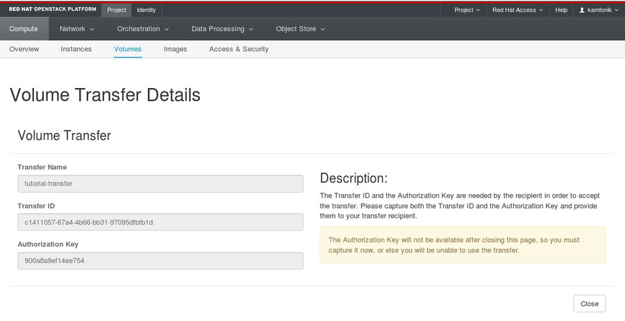

Assuming you have access to the receiving project, switch to it using the Project dropdown at the top right.

If you don't have access to the receiving project, give the transfer ID and key to a collaborator who does, and have them complete the next steps.

In the receiving project, go to the Volumes tab, and click Accept Volume Transfer.  In the example, we see that the receiving project already has a couple of volumes.

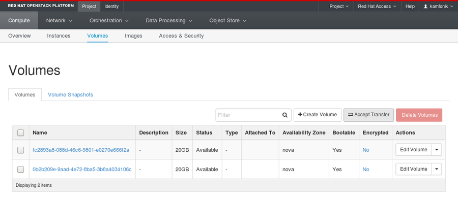

Enter the Transfer ID and the Transfer key that were captured when the transfer was created.

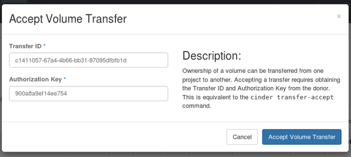

The volume should now appear in the Volumes list of the receiving project.

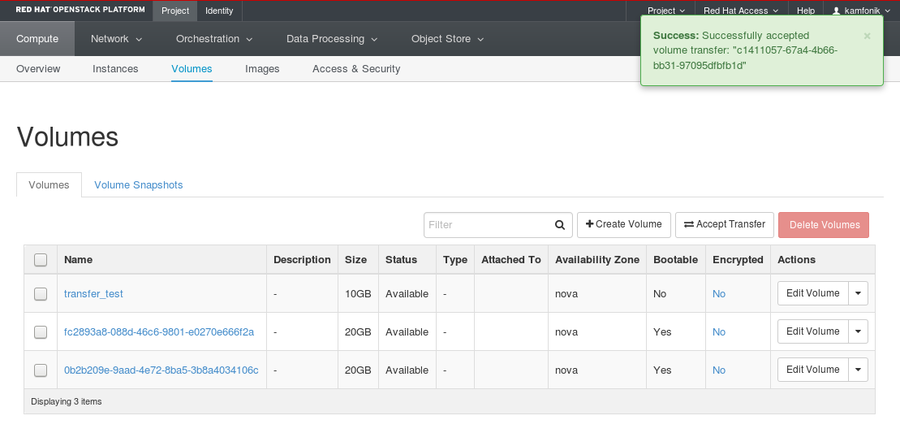

Note that pending transfers can be cancelled if they are not yet accepted, but there is no way to "undo" a transfer once it is complete.

To send the volume back to the original project, a new transfer would be required.

******

Next: [Object Storage](Object-Storage.html)  

Previous: [SSH to Cloud VM](SSH-to-Cloud-VM.html)

[Openstack Tutorial Index](OpenStack-Tutorial-Index.html)

