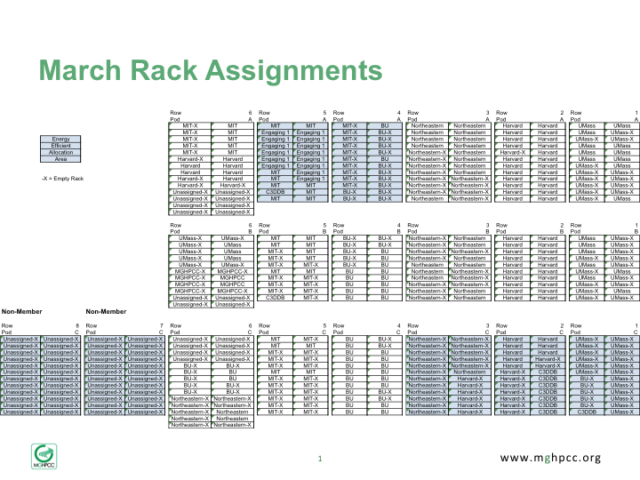
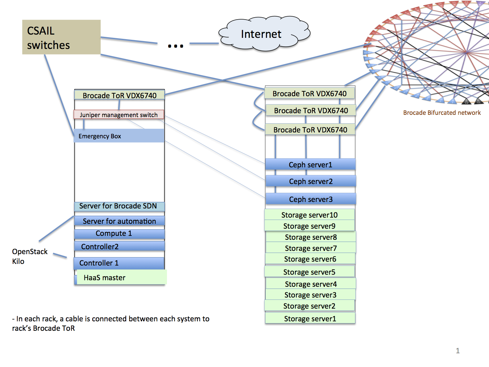

## Engage1 Network Documentation

### Switches and Gateway

The emergency gateway to login to engage1 is e1-e.massopen.cloud (129.10.5.129). Regular gateway is at 128.52.62.147 (moc-services).

From that host, you can login to the master brocade switch at 10.10.10.65. Rest of the switches are as follows:

```shell
RBridge-102# show vcs | include Online
2                10:00:50:EB:1A:A4:29:AC        10.10.10.68     Online           Online               RBridge-2
3                10:00:50:EB:1A:CF:43:28        10.10.10.69     Online           Online               RBridge-3
5                10:00:50:EB:1A:A4:0B:C0        10.10.10.71     Online           Online               RBridge-5
13               10:00:50:EB:1A:AE:97:EC        10.10.10.78     Online           Online               RBridge-13
14               10:00:50:EB:1A:AE:7D:04        10.10.10.79     Online           Online               RBridge-14
19               10:00:50:EB:1A:E7:60:CC        10.10.10.83     Online           Online               RBridge-19
101              10:00:50:EB:1A:A4:19:D8        10.10.10.64     Online           Online               RBridge-101
102             >10:00:50:EB:1A:A4:2A:F4*       10.10.10.65     Online           Online               RBridge-102
103              10:00:50:EB:1A:DE:B0:74        10.10.10.66     Online           Online               RBridge-103
104              10:00:50:EB:1A:E7:86:F8        10.10.10.67     Online           Online               RBridge-104
```

Note: Switches with ID 101, 102, 103 and 104 are in BU cages, the rest of the brocade switches are in MIT cages.
Furthermore, the management port on those switches is unreachable from our end; so they apprear online to the fabric
but we can't SSH to those so it is important that the principal node is on our end.

### Hardware and Networking Layout
Where is everything, and what is connected to what ? These spreadsheets will tell you:
 -  [Engage1_networks.xlsx](../../_static/xlsx/Engage1_networks.xlsx)
 -  [Engage1_racks_and_hardware.xlsx](../../_static/xlsx/Engage1_racks_and_hardware.xlsx)
 -  [Engage1_Brocade_cable_map.xlsx](../../_static/xlsx/Engage1_Brocade_cable_map.xlsx)

New management cable map can be found here: [Engage1 Management Cable Map](Engage1-Management-Cable-Map.html)

Old document is [here](../../_static/xlsx/Engage1_1G_cable_map.xlsx) just in case, but is completely outdated.)

Following is the snapshot of what the rack layout is as of March 2015



[MGHPCCRackAssignments032015.pptx](../../_static/MGHPCCRackAssignments032015.pptx)

Rough diagram of the Ceph storage:



### VLANs

| VLAN ID   | Used for                                                        |
| --------- | --------------------------------------------------------------- |
| 10        | Public Internet via CSAIL (old)                                 |
| 11        | ?                                                               |
| 105       | ?                                                               |
| 1602      | MRI Provisioning vlan                                           |
| 2000-2099 | **reserved for Anycast Setup**                                  |
| 2000      | Anycast Cache Transit                                           |
| 2007      | Anycast Cache Node 7                                            |
| 2008      | Anycast Cache Node 8                                            |
| 2009      | Anycast Cache Node 9                                            |
| 2010      | Anycast Cache Node 10                                           |
| 2100-2699 | **reserved for Anycast Computes**                               |
| 2100-2109 | Anycast compute vlans actually configured                       |
| 3000-3099 | HIL vlans                                                       |
| 3799      | BMI/BMI dev openstack floating IPs 172.31.0.0/22                |
| 3800-3850 | **reserved for MeetMe uses**                                    |
| 3800      | MeetMe                                                          |
| 3801      | MeetMe                                                          |
| 4001      | ?                                                               |
| 4003      | OpenFlow Vlan 1                                                 |
| 4004      | Foreman / Provisioning                                          |
| 4005      | OpenFlow Vlan 2                                                 |
| 4025      | ?                                                               |
| 4050      | Ceph                                                            |
| 4051      | HAAS?                                                           |
| 4052      | Engage1 openstack private 192.168.128.0/22                      |
| 4053      | Engage1 BMI openstack private 192.168.132.0/22                  |
| 4054      | Engage1 BMI dev openstack private 192.168.136.0/22              |
| 4060-4069 | Previously used by MRI nodes, should be replaced with 2100-2109 |
| 4080      | ?                                                               |

### IP addresses
 -  **Public (via CSAIL)**
     -  **VLAN 10** - infrastructure, CSAIL runs DHCP so that limits what can be done with it.
     -  **128.52.60.97**      engage1-emergency (enp4s0f0)
     -  **128.52.62.147**     moc-services (br10,eth0.10)
     -  **128.31.20.0/22**    VLAN 3801 - engage1 - mit/bu brocade fabric
     vlan 3802 - kaizen floaqting - 2 cisco switch
     vlan 3803 - kumo - bu cisco
*see details [below](#vlan-3801)*

### VLAN 3801
floating IPs, infrastructure with direct connection to Kai/Kumo 128.31.20.0/22
 -  **infrastructure**
     -  128.31.20.1 to 128.31.20.10 are reserved by CSAIL for network uses
     -  128.31.20.11 to 128.31.20.14 are reserved by MOC
     -  128.31.20.15 e1-radosgw-01  (VM on engage1-emergency)
 -  **OpenStack floating IPs** : 128.31.22.0 to 128.31.23.254

### Anycast (VLANS 2000-2699)
See [Engage1 Anycast Setup](Engage1-Anycast-Setup.html)

### OBM (VLAN 3040)
Includes OBM network for servers in MOC racks, as well as the cache servers in MIT's rack, via the Dell Switch in r5-pA-c1.

Previously the two switches were on different subnets, but these have been merged into a single 10.10.10.0/24 network as of 22 Jan 2016.
 -  **(.1 to .15 Network Reserved)**
     -  **10.10.10.1**   e1-r4pAc04-mgmt (Cisco WS-C3650), see bitwarden Engage1 egg1-r4pAc04-mgmt password - e1ipmi
     -  **10.10.10.2**   e1-r4pAc02-mgmt (Cisco WS-C3650), see bitwarden Engage1 egg1-r4pAc02-mgmt password - e1ipmi
     -  **10.10.10.3**   kumo switch r4-pA-c23-catalyst3650 (Cisco WS-C3650), other ip is 10.1.11.1 in kumo/kaizen - brdige between e1 and kumo ipmi.
     -  **10.10.10.4**   e1-cacti - VM on services or emergency
     -  **10.10.10.5**   e1-r4pAc04-mgmt-02 (Juniper)  (credentials: see Engage1 egg1-r4pAc04-mgmt-02)  - e1ipmi
     See [Kumo documentation](../kumo/Kumo-Network-Documentation.html) for Kumo switches
     -  **10.10.10.15**  moc-haas01 - HIL's interface on the ipmi network
     -  **10.10.10.16**    moc-haas01 (pyhiscal server's IPMI port) (48 gig, 8 cores/16 threads E5640)
     -  **10.10.10.17**    moc-services01
     -  **10.10.10.18**    moc-sdn01
     -  **10.10.10.19**    moc-controller01
     -  **10.10.10.20**    moc-controller02
     -  **10.10.10.21**    moc-compute03
     -  **10.10.10.22**    moc-emergency

     -  **10.10.10.27**    e1-compute-08 (openstack compute)
     -  **10.10.10.28**    e1-compute-09 (openstack compute)
     -  **10.10.10.29**    e1-vmhost-10 (staging kvm host)

     -  **10.10.10.34**   currently used by R4-PA-C4 PDUL (password not known)
     -  **10.10.10.35**   currently used by R4-PA-C4 PDUR (password not known)

 -  **Brocade Switches** (.64 to .95)
     -  **10.10.10.64**    RBridge-101 (A1)
     -  **10.10.10.65**    RBridge-102 (B1)
     -  **10.10.10.66**    RBridge-103 (C1)
     -  **10.10.10.67**    RBridge-104 (D6)
     -  **10.10.10.68**    RBridge-2 (D5)
     -  **10.10.10.69**    RBridge-3 (A2)
     -  **10.10.10.71**    reserved for RBridge-5 (A6)
     -  **10.10.10.78**    RBridge-13 (C2)
     -  **10.10.10.79**    RBridge-14 (C5)
     -  **10.10.10.83**    RBridge-19 (B5)
 -  **Ceph Storage**  (.96 to .119)

  14 bays per server, 2 for OS (4TB), 3 SSDs for journal
  (we are using filestore here,with bluestore the size of ssd is too small, 9 OSD X 4tb).
  SSDs can be used as block cache though it's not supported configuration.

     -  **10.10.10.101**     ceph-lenovo01
     -  **10.10.10.102**     ceph-lenovo02
     -  **10.10.10.103**     ceph-lenovo03
     -  **10.10.10.104**     ceph-lenovo04
     -  **10.10.10.105**     ceph-lenovo05
     -  **10.10.10.106**     ceph-lenovo06 (unreachable)
     -  **10.10.10.107**     ceph-lenovo07
     -  **10.10.10.108**     ceph-lenovo08
     -  **10.10.10.109**     ceph-lenovo09
     -  **10.10.10.110**     ceph-lenovo10
     -  **10.10.10.111**     ceph-quanta01
     -  **10.10.10.112**     ceph-quanta02
     -  **10.10.10.113**     ceph-quanta03
 -  **Admin Nodes**  (.120 to .127)
     -  **10.10.10.124**    moc-services01 (in-band access interface)
     -  **10.10.10.126**    engage1-emergency (in-band access interface)

### Ceph Client Network (VLAN 4050)
 -  **192.168.64.0/22**
     -  **192.168.64.1**       moc-services
     -  **192.168.64.2**       redhatvm
     -  **192.168.64.4**       moc-sdn01h
     -  **192.168.64.5**       moc-haas01
     -  **192.168.64.6**       e1-compute-07 (openshift node)
     -  **192.168.64.11**      ceph-lenovo01
     -  **192.168.64.12**      ceph-lenovo02
     -  **192.168.64.13**      ceph-lenovo03
     -  **192.168.64.14**      ceph-lenovo04
     -  **192.168.64.15**      ceph-lenovo05
     -  **192.168.64.16**      ceph-lenovo06
     -  **192.168.64.17**      ceph-lenovo07
     -  **192.168.64.18**      ceph-lenovo08
     -  **192.168.64.19**      ceph-lenovo09
     -  **192.168.64.20**      ceph-lenovo10

     -  **192.168.64.100**     ?

     -  **192.168.64.126**     engage1-emergency
     -  **192.168.64.201**     ceph-quanta01
     -  **192.168.64.202**     ceph-quanta02
     -  **192.168.64.203**     ceph-quanta03
     -  **192.168.65.111**     kumo-storage01
     -  **192.168.66.1**       e1-control-01
     -  **192.168.66.2**       e1-control-02
     -  **192.168.66.101**     e1-vcontrol-101
     -  **192.168.66.121**     Ceilometer (vm on e1-vhost-06)
     -  **192.168.66.122**     Openshift_Client (vm on e1-vhost-06)
     -  **192.168.66.161**     e1-mri-control-161
     -  **192.168.66.195**     e1-mri-compute-195
     -  **192.168.67.7**       cache-c07-01
     -  **192.168.67.8**       cache-c08-01
     -  **192.168.67.9**       cache-c09-01
     -  **192.168.67.10**      cache-c10-01
     -  **192.168.67.11**      e1-radosgw-01 (VM on e1-emergency)

### Dell Switch
MRI Dell Switch (for cache server IPMI) - located in r5-pA-c1.  It is accessed via an MIT gateway.

Instructions for how to log in are [here](Accessing-the-MRI-Dell-Switch.html)

### Login credentials
*These are likely to change away from the defaults in the near future.*
 -  **Quanta QSSC-S99-1U** (all 6 Kilo servers, 3 ceph-quanta servers, engage1-emergency)
     -  **Default credentials** : see bitwarden Engage1 Quanta QSSC-S99-1U
     -  **Default IPMI address**: 192.168.001.002
 -  **Lenovo Servers** (10 ceph-lenovo servers)
     -  **Default credentials** : see bitwarden Lenovo servers
     -  **Default IPMI address** : 192.168.70.125
 -  **BU Intel servers** (cache-c104, e1-compute-08, e1-compute-09, e1-compute-10)
     -  NO DEFAULT CREDENTIALS OR IP - must be set in BIOS
     -  **Currently set to** : see bitwarden Engage1 BU Intel servers
 -  **Cache servers**  (6 Intel servers)
     -  **Default credential**: see bitwarden Engage1 Cache Servers
     -  [Video](http://www.screencast.com/t/gazhGb8H)
 -  **Brocade Switches** (22 Brocade VDX 6740)
     -  **Credentials** : see bitwarden Engage1 Brocade Switches
     -  **Default credentials** : see bitwarden Engage1 Brocade switches
     -  **Default console IP** : none, set to DHCP

### Temporary Connections
Because I didn't have 10G cables or connectors, I connected one 1G NIC on the each of the new dell nodes to cisco-04 management switch.
 -  **dell-45 = port 21**
 -  **dell-46 = port 22**
 -  **dell-47 = port 23**
