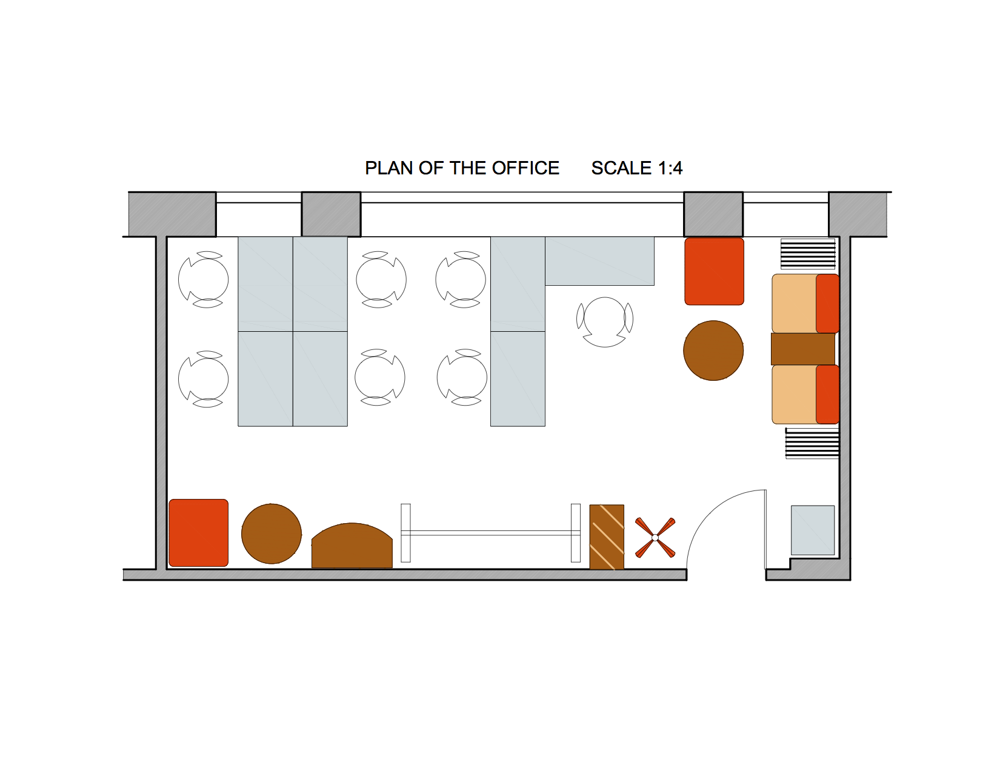
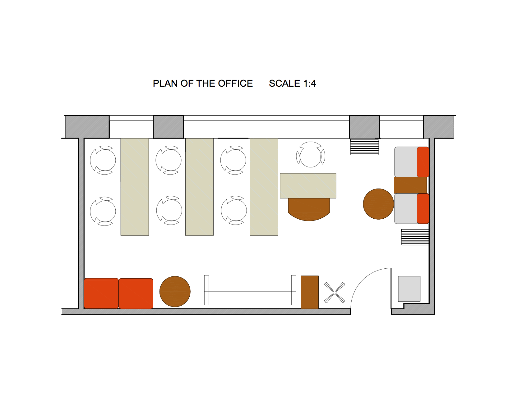
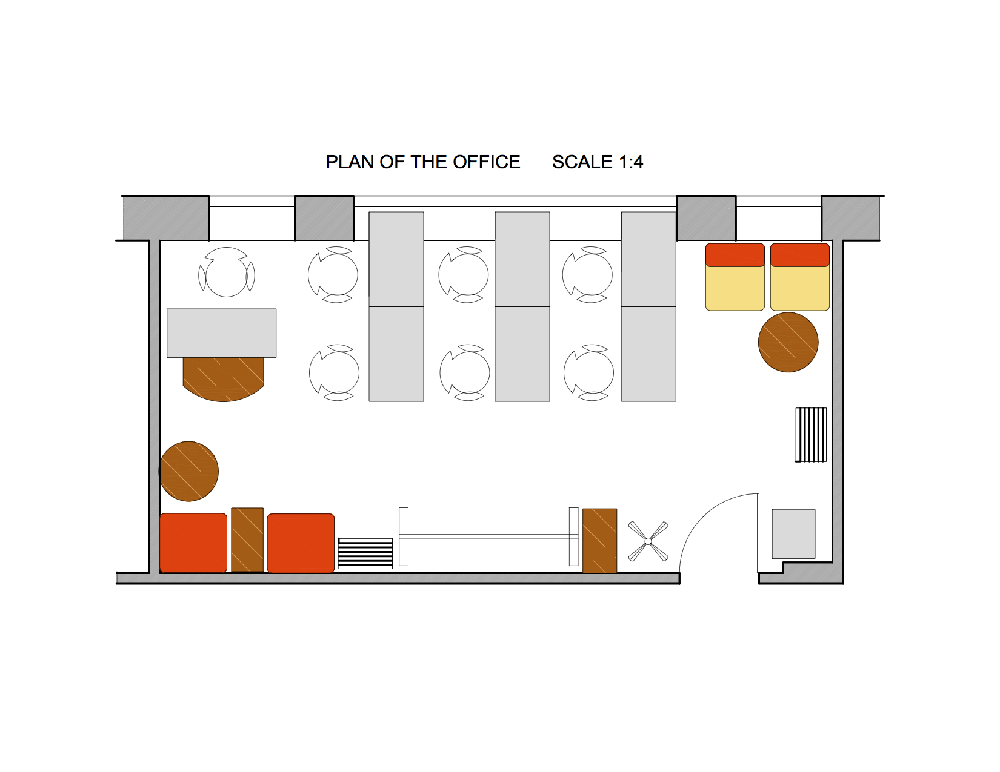
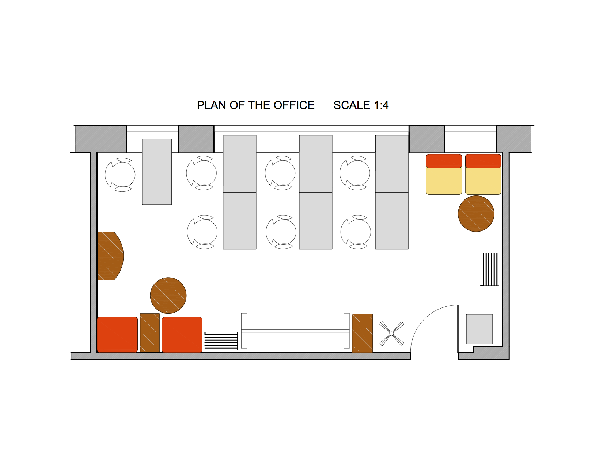

### Design 1 

### Design 2

In design 3 and 4, the 30" dead space between the large window and the current 3 white desks/tables is being put to use by   replacing/using adjustable legs for the tables. 

### Design 3

### Design 4

