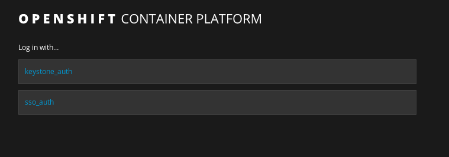
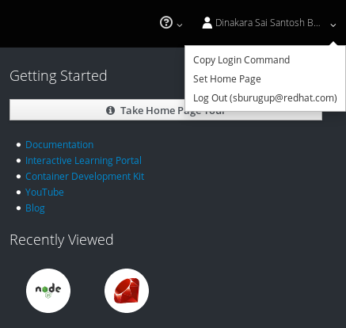
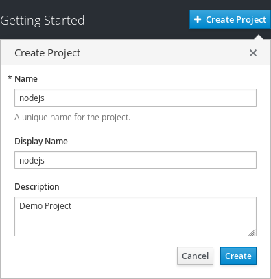
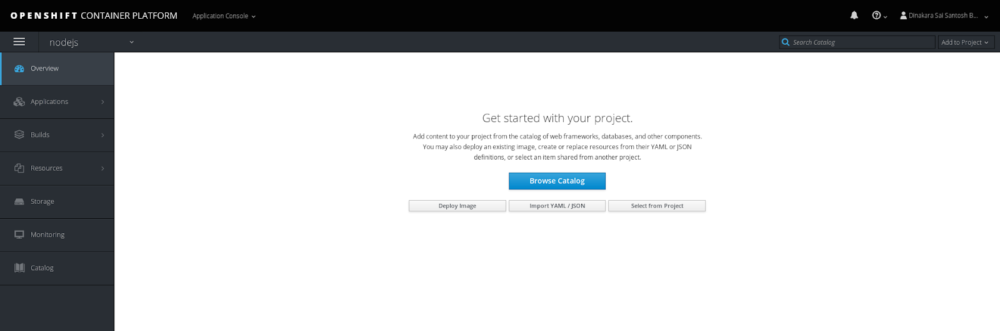
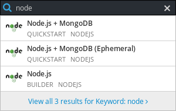
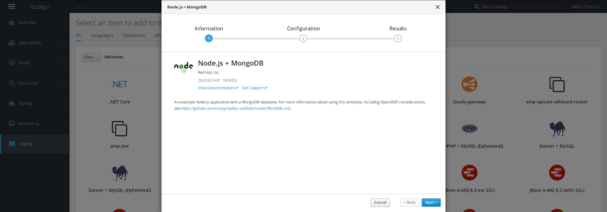
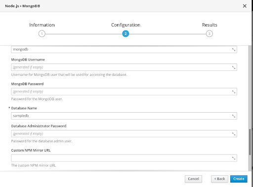
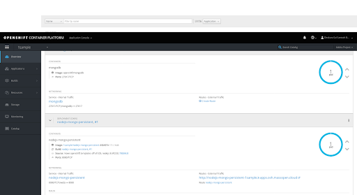
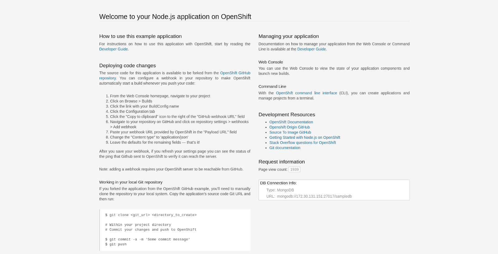

## Deploy Hello World Application on OpenShift

### Steps:
 - Type the cluster URL in the Browser and Login using SSO

 - Click on the Copy login command and paste onto the terminal, this will help to login through CLI

 - Click on create project, a  new project will be created. 
 - To view your projects, Click on Overview on the side menu bar. 

 

For the purpose of this tutorial we will use the custom template

 - For Deploying a Node JS + MongoDB website (search for Node in the right top corner)

Here we will be using Sample git repository (https://github.com/sclorg/nodejs-ex/blob/master/README.md)

Click Next, you  will be prompted onto Configuration setting of the application

In this step we will configure our application like database password, hostname of the website, database url etc. 

Enter the username and password for mongodb users and all the mandatory fields.

Click on create. Next, Click on View all projects. Click on the project you created. You should see the screen below

To access your application, Click on the hyperlink under Router - External Traffic

Your Application would look similar to  this 

Congratulations !! Your Node JS + Mongo DB application is succesfully deployed on Openshift

