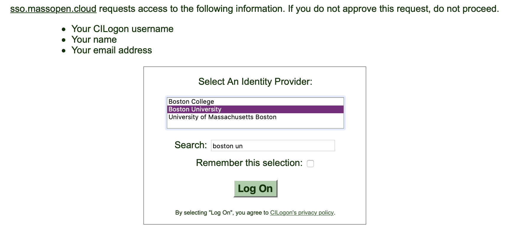

# Access the OpenStack Dashboard

The OpenStack Dashboard (Horizon) is located at [https://kaizen.massopen.cloud](https://kaizen.massopen.cloud).

The MOC supports logging in with you university accounts and it is the reccomended method of authentication. Select "Institution Account" and then "Sign In"

You can now select your university by using the search box and clicking "Log On." You will now be redirected to your institution's website where you can login with your normal credentials. The MOC does not see or have access to your institutional account credentials. To reset "Remember this selection", visit [cilogon.org/me](https://cilogon.org/me) and select "Delete Browser Cookies".

Once you login you should see an overview of the resources like instances(vms), CPU, RAM etc. Take some time to just browse around.

