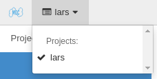
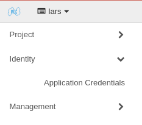
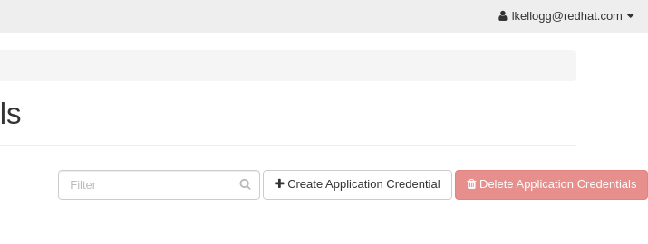
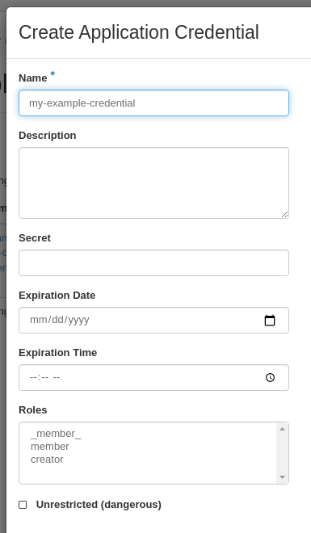

# Authenticating to OpenStack using application credentials

## Creating an Application Credential for Kaizen

1. Go to <https://onboarding.massopen.cloud> and log in with your institutional account.
1. Select the project for which you would like to create an application credential from the dropdown, similar to how you switch projects in the Kaizen dashboard.

    

1. Navigate to Identity > Application Credentials in the sidebar.

    

1. Click Create Application Credential

    

1. In the resulting dialog, specify a name, everything else is optional.

    

1. After creation, you will be prompted to download an RC file or a clouds.yaml file which looks something like the one below:

    ```
    # This is a clouds.yaml file, which can be used by OpenStack tools as a source
    # of configuration on how to connect to a cloud. If this is your only cloud,
    # just put this file in ~/.config/openstack/clouds.yaml and tools like
    # python-openstackclient will just work with no further config. (You will need
    # to add your password to the auth section)
    # If you have more than one cloud account, add the cloud entry to the clouds
    # section of your existing file and you can refer to them by name with
    # OS_CLOUD=openstack or --os-cloud=openstack
    clouds:
      openstack:

        auth:

          auth_url: https://kaizen.massopen.cloud:13000

          application_credential_id: "..."
          application_credential_secret: "..."

        region_name: "moc-kzn"

        interface: "public"
        identity_api_version: 3
        auth_type: "v3applicationcredential"
    ```
