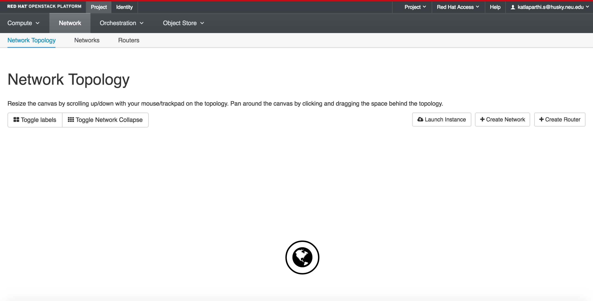
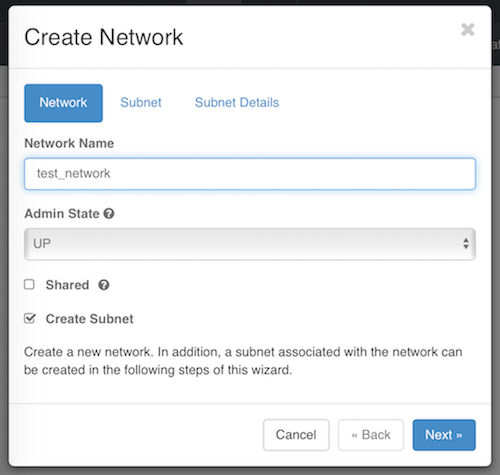
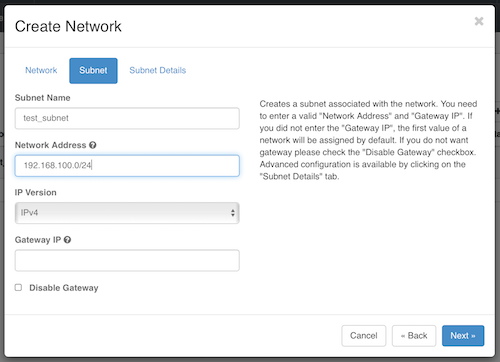
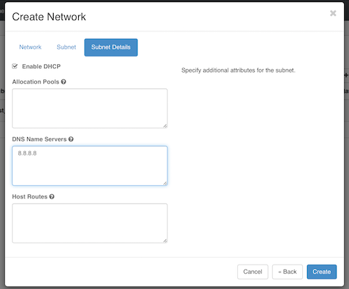
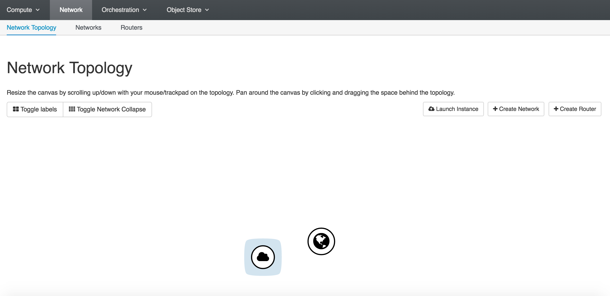

## Setup a Private Network

### Create a Network
You can view your network topology by clicking Project, then click Network and choose Network Topology from the menu that appears.

You should see the public network which is accessible to all projects.



Click the "Create Network" button on the right side of the screen, above the network topology map.
Give your network a name, and leave the two checkboxes with the default settings.



Next, click "Subnet" and set up your private network's subnet.

For your private networks, you should use IP addresses which fall within the ranges that are specifically reserved for private networks:
```shell
10.0.0.0/8
172.16.0.0/12
192.168.0.0/16
```
In the example below, we configure a network containing addresses 192.168.100.1 to 192.168.100.255.
*Technically, your private network will still work if you choose any IP outside these ranges,
but this causes problems with connecting to IPs in the outside world - so don't do it!*



Next, click "Subnet Details". Check the box next to Enable DHCP so that your VM instances will automatically be assigned an IP on the subnet.

In the DNS Name Servers box, type '8.8.8.8' (you may recognize this as one of Google's public name servers).



For now, leave the Allocation Pools and Host Routes boxes empty.  Click on Create.

The Network Topology should now show your virtual private network next to the public network.


